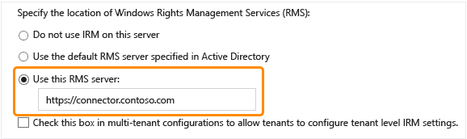

# Distribuera Azure Rights Management-koppling
Använd den här informationen om du vill veta mer om anslutningen för Microsoft Rights Management (RMS) och hur du kan använda det för att skydda information med befintliga lokala distributioner som använder Microsoft Exchange Server, Microsoft SharePoint Server och filservrar som kör Windows Server och använda filen klassificering infrastruktur (FCI)-funktionen för hanteraren för filserverresurser.

> [!TIP]
> Utförlig Exempelscenario med skärmdumpar, finns det [Skydda filer på filservrar som kör Windows Server och infrastruktur för klassificering av filen automatiskt](../Topic/What_is_Azure_Rights_Management_.md#BKMK_Example_FCI) i avsnittet den [Vad är Azure Rights Management?](../Topic/What_is_Azure_Rights_Management_.md) artikeln.

## <a name="OverviewConnector"></a>Översikt över Microsoft Rights Management-koppling
Microsoft Rights Management (RMS)-kopplingen kan du snabbt att befintliga lokala servrar ska kunna använda sina Information Rights Management (IRM)-funktioner med molnbaserade Microsoft Rights Management-tjänsten (Azure RMS). Med den här funktionen kan IT och användarna enkelt kan skydda dokument och bilder båda inom din organisation och utanför utan att behöva installera ytterligare infrastruktur eller etablerar förtroenderelationer med andra organisationer. Du kan använda den här anslutningen även om vissa av användarna ansluter till online-tjänster i ett scenario för hybrid. Till exempel vissa användarnas postlådor använda Exchange Online och vissa användarnas postlådor använder Exchange Server. När du installerar RMS-anslutningen alla användare kan skydda och använda e-post och bifogade filer med hjälp av Azure RMS och informationsskydd fungerar sömlöst mellan två distributionskonfigurationer.

RMS-koppling är en tjänst för små utrymmeskrav som du installerar lokalt på servrar som kör Windows Server 2012 R2, Windows Server 2012 eller Windows Server 2008 R2. Kör kopplingen på fysiska datorer, förutom att kan du också köras på virtuella datorer, inklusive Azure IaaS virtuella datorer. När du installerar och konfigurerar anslutningen kan fungerar det som ett kommunikationsgränssnitt (ett relay) mellan lokala servrar och Molntjänsten.

Om du hanterar klient nyckeln för Azure RMS (gör du äger nyckeln eller BYOK scenario), RMS-koppling och de lokala servrar som använder den inte kommer åt maskinvara säkerhetsmodulen (HSM) som innehåller din klient-nyckel. Detta beror på att alla kryptografiska åtgärder som använder klient-nyckel utförs i Azure RMS och inte lokalt.


Följande lokala servrar stöder RMS-anslutningen: Exchange Server, SharePoint Server och filservrar som kör Windows Server och använda filen klassificering infrastruktur för att klassificera och använda principer för Office-dokument i en mapp. Om du vill skydda alla filtyper med filen klassificering, ska du inte använda RMS-kopplingen, men Använd i stället de [RMS-skydd cmdlets](https://msdn.microsoft.com/library/azure/mt433195.aspx).

> [!NOTE]
> Vilka versioner av dessa lokala servrar finns i "lokala servrar som stöder Azure RMS" i den [Program som stöder Azure RMS](../Topic/Requirements_for_Azure_Rights_Management.md#BKMK_SupportedApplications) delen av den [Krav för Azure Rights Management](../Topic/Requirements_for_Azure_Rights_Management.md) artikeln.

Använd följande avsnitt som hjälper dig att planera, installera och konfigurera RMS-anslutningen. Sedan måste du göra vissa inlägg installationskonfigurationen så att dina servrar kan använda kopplingen.

-   [Prerequisites for the RMS connector](../Topic/Deploying_the_Azure_Rights_Management_Connector.md#BKMK_Prereqs)

-   **Steg 1:**  [Installing the RMS connector](../Topic/Deploying_the_Azure_Rights_Management_Connector.md#BKMK_InstallingConnector)

-   **Steg 2:**  [Entering credentials](../Topic/Deploying_the_Azure_Rights_Management_Connector.md#EnteringCredentials)

-   **Steg 3:**  [Authorizing servers to use the RMS connector](../Topic/Deploying_the_Azure_Rights_Management_Connector.md#AuthorizingServers)

-   **Steg 4:**  [Configuring load balancing and high availability](../Topic/Deploying_the_Azure_Rights_Management_Connector.md#ConfiguringConnector)

-   Valfritt: [Configuring the RMS connector to use HTTPS](../Topic/Deploying_the_Azure_Rights_Management_Connector.md#BKMK_ConfiguringHTTPS)

-   Valfritt: [Configuring the RMS connector for a web proxy server](../Topic/Deploying_the_Azure_Rights_Management_Connector.md#BKMK_ConfiguringWebProxy)

-   Valfritt: [Installing the RMS connector administration tool on administrative computers](../Topic/Deploying_the_Azure_Rights_Management_Connector.md#BKMK_InstallingStandaloneTool)

-   **Steg 5:**  [Configuring servers to use the RMS connector](../Topic/Deploying_the_Azure_Rights_Management_Connector.md#ConfiguringServers)

    -   [Configuring an Exchange server to use the connector](../Topic/Deploying_the_Azure_Rights_Management_Connector.md#BKMK_ExchangeServer)

    -   [Configuring a SharePoint server to use the connector](../Topic/Deploying_the_Azure_Rights_Management_Connector.md#BKMK_ConfiguringSharePoint)

    -   [Configuring a file server for File Classification Infrastructure to use the connector](../Topic/Deploying_the_Azure_Rights_Management_Connector.md#BKMK_FileServer)

-   [Next steps](../Topic/Deploying_the_Azure_Rights_Management_Connector.md#BKMK_NextSteps)

## <a name="BKMK_Prereqs"></a>Krav för RMS-koppling
Kontrollera att följande krav är uppfyllda innan du installerar RMS-anslutningen.

|Krav|Mer information|
|--------|-------------------|
|Tjänsten Rights Management (RMS) är aktiverad|[Aktivera Azure Rights Management](../Topic/Activating_Azure_Rights_Management.md)|
|Katalogsynkronisering mellan din Active Directory-skogar och Azure Active Directory|När RMS har aktiverats, måste Azure Active Directory konfigureras för att fungera med de användare och grupper i Active Directory-databasen. **Important:** Du måste göra det här steget för synkronisering av katalog för RMS-anslutningen fungerar, även för ett testnätverk. Men du kan använda Office 365 och Azure Active Directory med hjälp av konton som du skapar manuellt i Azure Active Directory, kräver den här anslutningen att kontona i Azure Active Directory är synkroniserad med Active Directory Domain Services; Manuell Lösenordssynkronisering räcker inte.<br />Mer information finns i följande resurser:<br /><br />-   [Anvisningar för att konfigurera Azure AD-klient](http://technet.microsoft.com/library/hh967611.aspx)<br />-   [Instruktioner för att aktivera katalogsynkronisering med AAD med DirSync](http://technet.microsoft.com/library/hh967642.aspx)|
|Valfritt men rekommenderas:<br /><br />-   Aktivera federering mellan din lokala Active Directory och Azure Active Directory|Du kan aktivera identitetsfederation mellan din lokala katalog och Azure Active Directory. Den här konfigurationen kan en mer sömlös användarupplevelse med enkel inloggning till RMS-tjänsten. Utan enkel inloggning uppmanas användarna sina autentiseringsuppgifter innan de kan använda rättighetsskyddat innehåll.<br /><br />Instruktioner att konfigurera federation med hjälp av Active Directory Federation Services (AD FS) i Active Directory Domain Services och Azure Active Directory, finns i [Checklista: Använda AD FS för att implementera och hantera enkel inloggning](http://technet.microsoft.com/library/jj205462.aspx) i Windows Server-biblioteket.|
|Minst två datorer som du vill installera RMS-anslutningen:<br /><br /><ul><li>En 64-bitars fysisk eller virtuell dator som kör något av följande operativsystem:<br /><br /><ul><li>Windows Server 2012 R2</li><li>Windows Server 2012</li><li>Windows Server 2008 R2</li></ul></li><li>Minst 1 GB RAM-minne</li><li>Minst 64 GB diskutrymme</li><li>Minst ett nätverkskort</li><li>Åtkomst till Internet via en brandvägg (eller webbproxy) som inte kräver någon autentisering</li><li>Måste vara i en skog eller domän som litar på andra skogar i organisationen som innehåller installationer av Exchange eller SharePoint-servrar som du vill använda med RMS-koppling</li></ul>|Du måste installera RMS-kopplingen för feltolerans och hög tillgänglighet på minst två datorer. **Tip:** Om du använder Outlook Web Access eller mobila enheter som använder Exchange ActiveSync IRM och det är viktigt att du har åtkomst till e-post och bifogade filer som skyddas av Azure RMS, rekommenderar vi att du distribuerar en belastningsutjämnad grupp koppling servrar för att säkerställa hög tillgänglighet.<br />Du behöver inte dedicerade servrar som kör kopplingen men du måste installera den på en separat dator från servrar som ska använda kopplingen. **Important:** Installera inte anslutningen på en dator som kör Exchange Server, SharePoint Server eller en server som är konfigurerad för filen klassificering infrastruktur om du vill använda funktioner från dessa tjänster med Azure RMS. Dessutom inte installera den här anslutningen på en domänkontrollant.|

## <a name="BKMK_InstallingConnector"></a>Installera RMS-koppling
När du har bekräftat förutsättningarna i föregående avsnitt, Använd följande instruktioner för att installera RMS-anslutningen:

1.  Identifiera datorer (minst två) som ska köra RMS-koppling. De måste uppfylla specifikationen minsta listas i föregående avsnitt.

    > [!NOTE]
    > Du installerar en enskild RMS-koppling (som består av flera servrar för hög tillgänglighet) per klient (Office 365 eller Azure AD-klient). Till skillnad från Active Directory RMS behöver du inte installera RMS-kopplingen i varje skog.

2.  Ladda ned källfilerna för RMS-anslutningen från den [Microsoft Download Center](http://go.microsoft.com/fwlink/?LinkId=314106).

    Hämta RMSConnectorSetup.exe om du vill installera RMS-koppling.

    Dessutom:

    -   Om du vill konfigurera anslutningen från en 32-bitars dator kan också hämta RMSConnectorAdminToolSetup_x86.exe.

    -   Om du vill använda verktyget serverkonfiguration för RMS-anslutningen för att automatisera konfigurationen av registerinställningar på du lokala servrar kan också ladda ned GenConnectorConfig.ps1.

3.  Kör på den dator som du vill installera RMS-anslutningen **RMSConnectorSetup.exe** med administratörsbehörighet.

4.  Välj på sidan Välkommen till på sidan för installationsprogrammet för Microsoft Rights Management-koppling **installera Microsoft Rights Management-koppling på datorn**, och klicka sedan på **Nästa**.

5.  Läs och Godkänn licensvillkoren för RMS-koppling och klicka på **Nästa**.

Ange ett konto och lösenord för att konfigurera RMS-anslutningen för att fortsätta.

## <a name="EnteringCredentials"></a>Ange autentiseringsuppgifter
Innan du kan konfigurera RMS-kopplingen, måste du ange autentiseringsuppgifter för ett konto som har behörighet att konfigurera RMS-anslutningen.

Om du har implementerat [onboarding kontroller](https://technet.microsoft.com/library/jj658941.aspx), se till att det konto du anger är att skydda innehåll. Om du har begränsad möjlighet att skydda innehållet i gruppen "IT-avdelningen" måste det konto som du anger här vara medlem i gruppen. Om inte, visas felmeddelandet: **Det gick inte att hitta platsen för av administrationstjänsten och organisation. Kontrollera att Microsoft Rights Management-tjänsten är aktiverad för din organisation.**

Du kan använda ett konto som har en av följande behörigheter:

-   **Office 365-Innehavaradministratör**: Ett konto som är en global administratör för Office 365-klientorganisation.

-   **Microsoft RMS-klienten Global administratör**: Ett konto med administratörsbehörighet på Microsoft RMS-klienten.

-   **Microsoft RMS koppling administratör**: Ett konto i Azure Active Directory som har beviljats behörighet för att installera och administrera RMS-koppling för organisationen.

    > [!NOTE]
    > Om du vill använda Microsoft RMS-kopplingen administratörskonto måste du först göra följande om du vill tilldela rollen Administratör RMS-anslutningen:
    > 
    > 1.  Hämta och installera Windows PowerShell för Rights Management på samma dator. Mer information finns i [Installera Windows PowerShell för Azure Rights Management](../Topic/Installing_Windows_PowerShell_for_Azure_Rights_Management.md).
    > 
    >     Starta Windows PowerShell med den **Kör som administratör** kommando och ansluta till tjänsten Azure RMS med hjälp av den [Anslut AadrmService](http://msdn.microsoft.com/library/windowsazure/dn629415.aspx) kommando:
    > 
    >     ```
    >     Connect-AadrmService                   //provide Office365 Tenant Administrator or Microsoft RMS Tenant Global Administrator credential
    >     ```
    > 2.  Kör sedan den [Lägg till AadrmRoleBasedAdministrator](http://msdn.microsoft.com/library/windowsazure/dn629417.aspx) kommandot med bara en av följande parametrar:
    > 
    >     ```
    >     Add-AadrmRoleBasedAdministrator -EmailAddress <email address> -Role "ConnectorAdministrator"
    >     ```
    > 
    >     ```
    >     Add-AadrmRoleBasedAdministrator -ObjectId <object id> -Role "ConnectorAdministrator"
    >     ```
    > 
    >     ```
    >     Add-AadrmRoleBasedAdministrator -SecurityGroupDisplayName <group Name> -Role "ConnectorAdministrator"
    >     ```
    >     Skriv till exempel: **Add-AadrmRoleBasedAdministrator -EmailAddress melisa@contoso.com -Role " ConnectorAdministrator "**
    > 
    >     Men de här kommandona använda rollen ConnectorAdministrator, kan du också använda rollen GlobalAdministrator här, samt.

Under installationen RMS koppling all nödvändig programvara har godkänts och installerats, Internet Information Services (IIS) är installerat om den inte redan finns och connector-programvaran har installerats och konfigurerats. Dessutom förbereds RMS för konfigurationen genom att skapa följande:

-   En tom tabell av servrar som har behörighet att använda anslutningen för att kommunicera med Azure RMS. Du ska lägga till servrar i den här tabellen senare.

-   En uppsättning säkerhetstoken för kopplingen, vilket tillåter operations med Azure RMS. Dessa token hämtas från Azure RMS och installeras på den lokala datorn i registret. De är skyddade med data protection application programming interface (DPAPI) och autentiseringsuppgifterna för kontot Lokalt System.

Gör följande på sista sidan i guiden och klicka sedan på **Slutför**:

-   Om detta är den första koppling som du har installerat, Välj inte **Starta connector-administratörskonsolen för att auktorisera servrar** just nu. Du väljer det här alternativet när du har installerat den andra (eller slutliga) RMS-anslutningen. Kör guiden i stället, igen på minst en dator. Du måste installera minst två kopplingar.

-   Om du har installerat den andra (eller slutliga) anslutningen, väljer **Starta connector-administratörskonsolen för att auktorisera servrar**.

> [!TIP]
> Det finns nu en verifieringstest som du kan utföra för att testa om webbtjänster för RMS-anslutningen är i funktion:
> 
> -   Från en webbläsare, ansluta till **http://&lt;connectoraddress&gt;/_wmcs/certification/servercertification.asmx**, ersätts *&lt; connectoraddress &gt;* med serveradressen eller namnet som har installerat RMS-kopplingen. En anslutning har upprättats visas en **ServerCertificationWebService** sidan.

Om du behöver avinstallera RMS-anslutningen kan köra guiden igen och väljer alternativet avinstallera.

## <a name="AuthorizingServers"></a>Auktorisera servrar att använda RMS-kopplingen
När du har installerat RMS-anslutning på minst två datorer, är du redo att auktorisera servrar och tjänster som du vill använda RMS-anslutningen. Till exempel servrar som kör Exchange Server 2013 eller SharePoint Server 2013.

Kör verktyget RMS anslutning administration för att definiera dessa servrar och lägga till poster i listan över tillåtna servrar. Du kan köra det här verktyget om du väljer **Starta connector-administrationskonsolen för att auktorisera servrar** i slutet av Microsoft Rights Management-koppling installationsprogrammet guiden, eller om du kan köra den separat från guiden.

När du godkänner dessa servrar måste vara medveten om följande överväganden:

-   Servrar som du har lagt till kommer att beviljas särskilda behörigheter. Alla konton som du anger för Exchange Server-rollen i kopplingens konfiguration kommer att beviljas den [super användarroll](https://technet.microsoft.com/library/mt147272.aspx) i Azure RMS, vilket ger dem åtkomst till allt innehåll för den här RMS-klienten. Super user-funktionen aktiveras automatiskt i det här fallet, om det behövs. Var noga med att ange vilka konton som används av din organisations Exchange-servrar för att undvika det en risken för höjning av privilegier. Alla servrar som konfigurerats som SharePoint-servrar eller filservrar som använder FCI beviljas reguljära användarbehörigheter.

-   Du kan lägga till flera servrar som en enda post genom att ange en Active Directory-säkerhetsgrupper eller distributionsgrupp eller ett tjänstkonto som används av fler än en server. När du använder den här konfigurationen, grupp av servrar som delar samma RMS-certifikat och alla beaktas ägare för någon av dem har skyddat innehåll. Om du vill minimera administrativa omkostnader, rekommenderar vi att du använder den här konfigurationen av en grupp i stället för enskilda servrar som tillåter att Exchange-servrar i din organisation eller en SharePoint-servergrupp.

På den **servrar kunna utnyttja kopplingen** klickar du på **Lägg till**.

### <a name="BKMK_AddServer"></a>Lägga till en server i listan över tillåtna servrar
På den **tillåta att en server att använda kopplingen** kan du ange namnet på objektet eller Bläddra för att identifiera objekt att godkänna.

Det är viktigt att du godkänner rätt objekt. Det konto som kör tjänsten lokalt (till exempel Exchange eller SharePoint) måste väljas för auktorisering för en server att använda kopplingen. Till exempel om tjänsten körs som ett konfigurerat konto, lägga till namnet på det tjänstkontot i listan. Om tjänsten körs som lokalt System, lägga till namnet på datorobjekt (till exempel servernamn$). Som du bör skapa en grupp som innehåller dessa konton och ange gruppen i stället för namn på enskilda servrar.

Mer information om de olika serverrollerna:

-   För servrar som kör Exchange: Du måste ange en säkerhetsgrupp och du kan använda standardgruppen (**Exchange-servrar**) som Exchange automatiskt skapar och underhåller för alla Exchange-servrar i skogen.

-   För servrar som kör SharePoint:

    -   Om en SharePoint 2010-server är konfigurerad för att köras som lokalt System (den inte använder ett tjänstkonto), manuellt skapa en säkerhetsgrupp i Active Directory Domain Services och lägga till namn datorobjektet för servern i den här konfigurationen till den här gruppen.

    -   Om en SharePoint-server är konfigurerad för att använda ett tjänstkonto (rekommenderas för SharePoint 2010) och det enda alternativet för SharePoint 2013, gör du följande:

        1.  Lägg till kontot som kör tjänsten SharePoint Central Administration om du vill aktivera SharePoint konfigureras från dess-administratörskonsolen.

        2.  Lägga till kontot som är konfigurerad för SharePoint App poolen.

        > [!TIP]
        > Om dessa två konton är olika överväga att skapa en grupp som innehåller både konton för att minska administrativa kostnader.

-   För filservrar med filen klassificering infrastruktur kör tillhörande tjänster som det lokala systemkontot så måste du godkänna datorkontot för filservrar (till exempel servernamn$) eller en grupp som innehåller dessa konton.

När du är klar med att lägga till servrar i listan klickar du på **Stäng**.

Om du inte redan gjort det, måste du nu konfigurera belastningsutjämning för servrar som har installerat RMS-kopplingen och överväga att använda HTTPS för anslutningarna mellan dessa servrar och de servrar som du har fått behörighet.

## <a name="ConfiguringConnector"></a>Konfigurera belastningen Utjämning av nätverksbelastning och hög tillgänglighet
När du har installerat den andra eller sista instansen av RMS-koppling, ange ett namn på URL: en koppling och konfigurera en belastningsutjämning system.

Namnet på kopplingen URL: en server kan vara vilket namn under ett namnområde som du bestämmer. Du kan till exempel skapa en post i DNS-systemet för **rmsconnector.contoso.com** och konfigurera den här posten om du vill använda en IP-adress i systemet för belastningsutjämning. Det finns inga särskilda krav för det här namnet och det behöver inte vara konfigurerad på kopplingen servrarna. Om dina Exchange- och SharePoint-servrar ska ska kommunicera med anslutningen via Internet, är inte det här namnet lösa på Internet.

> [!IMPORTANT]
> Vi rekommenderar att du inte ändrar namnet när du har konfigurerat Exchange eller SharePoint-servrar för att använda kopplingen, eftersom du måste avmarkera servrarna alla konfigurationer av IRM och sedan konfigurera om.

När namnet har skapats i DNS och är konfigurerad för en IP-adress, konfigurera belastningsutjämning för den adress som dirigerar trafik till connector-servrar. Du kan använda alla IP-baserade belastningsutjämnare för detta ändamål som innehåller funktionen (Utjämning av nätverksbelastning) i Windows Server. Mer information finns i [Load Balancing Deployment Guide](http://technet.microsoft.com/library/cc754833%28v=WS.10%29.aspx).

Använd följande inställningar för att konfigurera NLB-kluster:

-   Portar: 80 (för HTTP) eller 443 (för HTTPS)

    Mer information om att använda HTTP eller HTTPS finns i nästa avsnitt.

-   Mappning mellan: Ingen

-   Distributionssätt: Lika med

Det här som du definierar för Utjämning av nätverksbelastning (för servrar som kör kopplingstjänsten RMS) är organisationens RMS-kopplingsnamnet som du ska använda senare när du konfigurerar de lokala servrarna att använda Azure RMS.

## <a name="BKMK_ConfiguringHTTPS"></a>Konfigurera RMS-anslutningen för att använda HTTPS
> [!NOTE]
> Det här konfigurationssteget är valfritt men rekommenderas för ytterligare säkerhet.

Även om användning av TLS eller SSL är valfritt för RMS-kopplingen, rekommenderar vi den för en HTTP-baserade känsliga tjänst. Den här konfigurationen autentiserar servrarna med anslutningen till din Exchange- och SharePoint-servrar som använder anslutningen. Dessutom krypteras alla data som skickas från dessa servrar till anslutningen.

Om du vill aktivera RMS anslutningen ska använda TLS, på varje server som kör RMS-anslutningen kan installera certifikat för serverautentisering som innehåller det namn som ska användas för anslutningen. Till exempel om RMS-koppling namn som du har definierats i DNS är **rmsconnector.contoso.com**, distribuera ett certifikat för serverautentisering som innehåller **rmsconnector.contoso.com** i certifikatämnet som nätverksnamn. Alternativt kan du ange **rmsconnector.contoso.com** i certifikatets alternativa namn som de DNS-värdet. Certifikatet behöver inte inkludera namnet på servern. I IIS, binda det här certifikatet till standardwebbplatsen.

Om du använder HTTPS-alternativet måste du kontrollera att alla servrar som kör kopplingen har en giltig serverautentisering certifikat som går att härleda till en rotcertifikatutfärdare som litar på Exchange- och SharePoint-servrar. Dessutom om certifikatutfärdaren (CA) som utfärdade certifikaten för koppling servrar publicerar en lista över återkallade certifikat (CRL), måste Exchange och SharePoint-servrar kunna ladda ned den här listan över återkallade certifikat.

> [!TIP]
> Du kan använda följande information och resurser som hjälper dig att begära och installera ett certifikat för serverautentisering och att binda till standardwebbplatsen i IIS för det här certifikatet:
> 
> -   Om du använder Active Directory Certificate Services (AD CS) och en företagscertifikatutfärdare (CA) för att distribuera dessa certifikat för serverautentisering, kan du kopiera och sedan använda certifikatmallen webbserver. Denna certifikatmall använder **anges i begäran** för certifikatets ämnesnamn, vilket innebär att du kan ange det fullständiga Domännamnet för RMS Kopplingsnamn för certifikatets namn eller alternativa namn när du begär certifikatet.
> -   Om du använder en fristående Certifikatutfärdare eller köpa det här certifikatet från ett annat företag, se [Konfigurera Internet servercertifikat (IIS 7)](http://technet.microsoft.com/library/cc731977%28v=ws.10%29.aspx) i den [webbserver (IIS)](http://technet.microsoft.com/library/cc753433%28v=ws.10%29.aspx) dokumentationsbiblioteket på TechNet.
> -   Om du vill konfigurera IIS att använda certifikat finns [lägga till en bindning till en plats (IIS 7)](http://technet.microsoft.com/library/cc731692.aspx) i den i den [webbserver (IIS)](http://technet.microsoft.com/library/cc753433%28v=ws.10%29.aspx) dokumentationsbiblioteket på TechNet.

## <a name="BKMK_ConfiguringWebProxy"></a>Konfigurera RMS-anslutning för en proxyserver
Om servrarna koppling installeras i ett nätverk som inte har direkt Internetanslutning och kräver manuell konfiguration av en webbproxyserver utgående för åtkomst till Internet, måste du konfigurera registret på dessa servrar för RMS-anslutningen.

#### Att konfigurera RMS-anslutningen för att använda en proxyserver

1.  Öppna Registereditorn, till exempel Regedit på varje server som kör RMS-koppling.

2.  Gå till **HKEY_LOCAL_MACHINE\SOFTWARE\Microsoft\AADRM\Connector**

3.  Lägga till strängvärdet för **ProxyAddress** och ange sedan Data för det här värdet för att **http://&lt;MyProxyDomainOrIPaddress&gt;:&lt;MyProxyPort&gt;**

    Exempel: **http://proxyserver.contoso.com:8080**

4.  Stäng Registereditorn och starta om servern eller utföra en IISReset för att starta om IIS.

## <a name="BKMK_InstallingStandaloneTool"></a>Installera administration anslutningsverktyget RMS på administrativa datorer
Du kan köra verktyget RMS anslutning administration från en dator som inte har installerat RMS kopplingen om datorn uppfyller följande krav:

-   En fysisk eller virtuell dator som kör Windows Server 2012 eller Windows Server 2012 R2 (alla versioner), Windows Server 2008 R2 eller Windows Server 2008 R2 Service Pack 1 (alla versioner), Windows 8.1, Windows 8 eller Windows 7.

-   Minst 1 GB RAM-minne.

-   Minst 64 GB diskutrymme.

-   Minst ett nätverkskort.

-   Åtkomst till Internet via en brandvägg (eller webbproxy).

Om du vill installera RMS-anslutningsverktyget för administration, kör du följande filer:

-   För en 32-bitarsdator: RMSConnectorAdminToolSetup_x86.exe

-   För en 64-bitarsdator: RMSConnectorSetup.exe

Om du inte redan har hämtat filerna, kan du göra detta från den [Microsoft Download Center](http://go.microsoft.com/fwlink/?LinkId=314106).

## <a name="ConfiguringServers"></a>Konfigurera servrar att använda RMS-kopplingen
När du har installerat och konfigurerat RMS-anslutningen, är du redo att konfigurera dina lokala servrar som ska använda Rights Management och ansluta till Azure RMS med hjälp av kopplingen. Det innebär att konfigurera följande servrar:

-   För Exchange 2013: -Klientåtkomstservrar och postlådeservrar

-   För Exchange 2010: -Klientåtkomstservrar och hub transport-servrar

-   För SharePoint: När du konfigurerar SharePoint-webbservrar, inklusive de som värd för Central Administration av server

-   För filen klassificering infrastrukturen: Windows Server-datorer som har installerat resurshanterare

Den här konfigurationen kräver registerinställningar. Om du vill göra detta, har du två alternativ:

|Konfigurationsalternativ|Fördelar|Nackdelar|
|----------------------------|------------|-------------|
|Automatiskt med hjälp av verktyget serverkonfiguration för Microsoft RMS-koppling|Ingen direkt redigering av registret. Detta är automatisk med ett skript.<br /><br />Du behöver inte köra en Windows PowerShell-cmdlet för att hämta Microsoft RMS-URL: en.<br /><br />Kraven kontrolleras automatiskt (men inte automatiskt åtgärdas) om du kör lokalt.|När du kör verktyget gör du en anslutning till en server som redan kör RMS-koppling.|
|Manuellt genom att redigera registret|Det krävs ingen anslutning till en server som kör RMS-koppling.|Flera administrativa kostnader som är felbenägna.<br /><br />Du måste hämta din Microsoft RMS-URL, vilket kräver att du kör ett Windows PowerShell-kommando.<br /><br />Du måste alltid se alla kontrollerna av förutsättningar själv.|
> [!IMPORTANT]
> I båda fallen måste du manuellt installera nödvändiga komponenter och konfigurerar Exchange, SharePoint och filen klassificering infrastruktur för att använda Rights Management.

För de flesta organisationer är automatisk konfiguration med hjälp av verktyget serverkonfiguration för Microsoft RMS-kopplingen alternativet bättre eftersom det ger större effektivitet och tillförlitlighet än manuell konfiguration.

När du har gjort ändringar i konfigurationen på dessa servrar, du måste starta om dem om de kör Exchange eller SharePoint och tidigare har konfigurerats för att använda AD RMS. Det finns inga behöver starta om servrarna om du konfigurerar dem för Rights Management för första gången. Du måste alltid starta om den filserver som är konfigurerad för att använda filen klassificering infrastrukturen när du har gjort ändringarna.

#### Hur du använder verktyget serverkonfiguration för Microsoft RMS-koppling

1.  Om du inte redan har hämtat skriptet för verktyget serverkonfiguration för Microsoft RMS-anslutningen (GenConnectorConfig.ps1), kan du hämta det från den [Microsoft Download Center](http://go.microsoft.com/fwlink/?LinkId=314106).

2.  Spara filen GenConnectorConfig.ps1 på datorn där verktyget körs. Om du kör verktyget lokalt, måste detta vara den server som du vill konfigurera för att kommunicera med RMS-anslutningen. Annars kan du spara den på en dator.

3.  Bestäm hur du kör verktyget:

    -   **Lokalt**: Du kan köra verktyget interaktivt från servern konfigureras för att kommunicera med RMS-anslutningen. Detta är användbart för en oneoff konfiguration, till exempel en testmiljö.

    -   **Programdistribution**: Du kan köra verktyget för att ge registerfilerna som du sedan distribuerar till en eller flera relevanta servrar med hjälp av en system management-program som har stöd för programdistribution, till exempel System Center Configuration Manager.

    -   **Grupprincip**: Du kan köra verktyget för att skapa ett skript som du ger en administratör som kan skapa grupprincipobjekt för servrar som ska konfigureras. Det här skriptet skapar ett grupprincipobjekt för varje server som ska konfigureras som administratören kan sedan tilldela relevanta servrar.

    > [!NOTE]
    > Det här verktyget konfigurerar servrar som ska kommunicera med RMS-kopplingen och som visas i början av det här avsnittet. Kör inte det här verktyget på servrar som kör RMS-kopplingen.

4.  Starta Windows PowerShell med den **Kör som administratör** alternativet och läsa instruktioner med kommandot Get-help använda verktyget för dina valda konfigurationsmetoden:

    ```
    Get-help .\GenConnectorConfig.ps1 -detailed
    ```

När verktyget körs måste du ange URL för RMS-kopplingen för din organisation. Ange protokollprefixet (HTTP:// eller HTTPS://) och namnet på den koppling som du har definierat i DNS för Utjämning av nätverksbelastning-adressen för en koppling. Till exempel https://connector.contoso.com. Verktyget sedan använder URL: en för att kontakta servrarna med RMS-koppling och hämta andra parametrar som används för att skapa konfigurationerna som krävs.

> [!IMPORTANT]
> När du kör det här verktyget kan du kontrollera att du anger namnet på kopplingen belastningsutjämnade RMS för din organisation och inte namnet på en enda server som kör kopplingstjänsten RMS.

Använd följande avsnitt för specifik information för varje typ av tjänst:

-   [Configuring an Exchange server to use the connector](../Topic/Deploying_the_Azure_Rights_Management_Connector.md#BKMK_ExchangeServer)

-   [Configuring a SharePoint server to use the connector](../Topic/Deploying_the_Azure_Rights_Management_Connector.md#BKMK_ConfiguringSharePoint)

-   [Configuring a file server for File Classification Infrastructure to use the connector](../Topic/Deploying_the_Azure_Rights_Management_Connector.md#BKMK_FileServer)

> [!NOTE]
> När dessa servrar har konfigurerats för att använda kopplingen kanske klientprogram som är lokalt installerade på servrarna inte fungerar med RMS. När detta sker beror på program som försöker använda kopplingen i stället för att använda RMS direkt, vilket inte stöds.
> 
> Dessutom om Office 2010 installeras lokalt på en Exchange server, kanske IRM-funktionerna i klientappen fungerar från datorn när servern är konfigurerad för att använda kopplingen, men detta stöds inte.
> 
> I båda fallen måste du installera program på separata datorer som inte är konfigurerade för användning av kopplingen. De korrekt använder RMS direkt.

### <a name="BKMK_ExchangeServer"></a>Konfigurera en Exchange-server för att använda connector
Följande Exchange roller kommunicerar med RMS-anslutningen:

-   För Exchange 2013: Klientåtkomstserver och postlådeserver

-   För Exchange 2010: Klientåtkomstserver och hub transport-server

Om du vill använda RMS-anslutning måste dessa servrar som kör Exchange köra ett av följande programvaruversioner:

-   Exchange Server 2013 med Exchange 2013 Cumulative Update 3

-   Exchange Server 2010 med Exchange 2010 Service Pack 3 Samlad uppdatering 6

Du måste också installera på dessa servrar, en version av RMS-klienten som inkluderar stöd för RMS kryptografiskt läge 2. Den lägsta versionen som stöds i Windows Server 2008 ingår i den snabbkorrigering som du kan hämta från [RSA nyckellängd ökas till 2 048 bitar för AD RMS i Windows Server 2008 R2 och Windows Server 2008](http://support.microsoft.com/kb/2627272). Den lägsta versionen för Windows Server 2008 R2 kan hämtas från [RSA nyckellängd ökas till 2 048 bitar för AD RMS i Windows 7 eller Windows Server 2008 R2](http://support.microsoft.com/kb/2627273). Windows Server 2012 och Windows Server 2012 R2 stöder kryptografiskt läge 2.

> [!IMPORTANT]
> Om dessa versioner eller senare versioner av Exchange och RMS-klienten inte är installerade, kan du inte konfigurera Exchange för att använda anslutningen. Kontrollera att dessa versioner är installerade innan du fortsätter.

##### Konfigurera Exchange Server för att använda connector

1.  På Exchange-serverroller som kommunicerar med RMS-anslutningen, gör du något av följande:

    -   Köra server configuration tool för Microsoft RMS-koppling. Mer information finns i [How to use the server configuration tool for Microsoft RMS connector](../Topic/Deploying_the_Azure_Rights_Management_Connector.md#BKMK_HowToRunTheTool) i det här avsnittet.

    -   Göra ändringar i registret manuellt med tabellerna i de följande avsnitten manuellt lägga till registerinställningar på servrarna.

2.  Aktivera IRM-funktionerna i Exchange. Mer information finns i [Information Rights Management procedurer](https://technet.microsoft.com/library/dd351212%28v=exchg.150%29.aspx) i Exchange-biblioteket.

Du kan använda tabellerna i de följande avsnitten bara om du vill lägga till manuellt eller kontrollera registerinställningar på servrarna, som konfigurerar servrar att använda RMS-kopplingen. Instruktioner för när du använder dessa tabeller:

-   *MicrosoftRMSURL* är organisationens Microsoft RMS-tjänstens URL. Du hittar det här värdet:

    1.  Kör den [Get-AadrmConfiguration](http://msdn.microsoft.com/library/windowsazure/dn629410.aspx) för Azure RMS. Om du inte redan installerat Windows PowerShell-modul för Azure RMS, se [Installera Windows PowerShell för Azure Rights Management](../Topic/Installing_Windows_PowerShell_for_Azure_Rights_Management.md).

    2.  Från utdata, identifiera den **LicensingIntranetDistributionPointUrl** värde.

        Exempel: **LicensingIntranetDistributionPointUrl: https://5c6bb73b-1038-4eec-863d-49bded473437.rms.na.aadrm.com/_wmcs/licensing**

    3.  Ta bort från värdet **/_wmcs/licensing** från strängen. Återstående strängen är Microsoft RMS-URL: en. I vårt exempel är Microsoft RMS-URL följande värde:

        **https://5c6bb73b-1038-4eec-863d-49bded473437.RMS.na.aadrm.com**

-   *ConnectorFQDN* belastningsutjämnande namnet som du har definierat i DNS för kopplingen. Till exempel **rmsconnector.contoso.com**.

-   Använd prefixet HTTPS för URL: en koppling om du har konfigurerat anslutningen för att använda HTTPS för att kommunicera med dina lokala servrar. Mer information finns i [Configuring the RMS connector to use HTTPS](../Topic/Deploying_the_Azure_Rights_Management_Connector.md#BKMK_ConfiguringHTTPS) i det här avsnittet. URL: er för Microsoft RMS använda alltid HTTPS.

#### Tabellen för registerinställningar för Exchange 2013

|Sökväg till register|Typ|Värde|Data|
|------------------------|-------|---------|--------|
|HKEY_LOCAL_MACHINE\Software\Microsoft\MSDRM\ServiceLocation\Activation|Reg_SZ|Som standard|https://*MicrosoftRMSURL/_wmcs/certification*|
|HKEY_LOCAL_MACHINE\Software\Microsoft\MSDRM\ServiceLocation\EnterprisePublishing|Reg_SZ|Som standard|https://MicrosoftRMSURL/_wmcs/Licensing|
|HKEY_LOCAL_MACHINE\SOFTWARE\Microsoft\ExchangeServer\v15\IRM\CertificationServerRedirection|Reg_SZ|https://*MicrosoftRMSURL*|En av följande, beroende på om du använder HTTP eller HTTPS från Exchange-servern RMS-anslutningen:<br /><br />-   http://*ConnectorFQDN*<br />-   https://*ConnectorFQDN*|
|HKEY_LOCAL_MACHINE\SOFTWARE\Microsoft\ExchangeServer\v15\IRM\LicenseServerRedirection|Reg_SZ|https://*MicrosoftRMSURL*|En av följande, beroende på om du använder HTTP eller HTTPS från Exchange-servern RMS-anslutningen:<br /><br />-   http://*ConnectorFQDN*<br />-   https://*ConnectorFQDN*|

#### Tabellen för registerinställningar för Exchange 2010

|Sökväg till register|Typ|Värde|Data|
|------------------------|-------|---------|--------|
|HKEY_LOCAL_MACHINE\Software\Microsoft\MSDRM\ServiceLocation\Activation|Reg_SZ|Som standard|https://*MicrosoftRMSURL*/_wmcs/certification|
|HKEY_LOCAL_MACHINE\Software\Microsoft\MSDRM\ServiceLocation\EnterprisePublishing|Reg_SZ|Som standard|https://*MicrosoftRMSURL*/_wmcs/Licensing|
|HKEY_LOCAL_MACHINE\SOFTWARE\Microsoft\ExchangeServer\v14\IRM\CertificationServerRedirection|Reg_SZ|https://*MicrosoftRMSURL*|En av följande, beroende på om du använder HTTP eller HTTPS från Exchange-servern RMS-anslutningen:<br /><br />-   http://*ConnectorFQDN*<br />-   https://*ConnectorFQDN*|
|HKEY_LOCAL_MACHINE\SOFTWARE\Microsoft\ExchangeServer\v14\IRM\LicenseServerRedirection|Reg_SZ|https://*MicrosoftRMSURL*|En av följande, beroende på om du använder HTTP eller HTTPS från Exchange-servern RMS-anslutningen:<br /><br />-   http://*ConnectorFQDN*<br />-   https://*ConnectorFQDN*|

### <a name="BKMK_ConfiguringSharePoint"></a>Konfigurera en SharePoint-server för kopplingen
Följande SharePoint-roller kommunicerar med RMS-anslutningen:

-   När du konfigurerar SharePoint-webbservrar, inklusive de som värd för Central Administration av server

Om du vill använda RMS-anslutning måste dessa SharePoint-servrar köra ett av följande programvaruversioner:

-   SharePoint Server 2013

-   SharePoint Server 2010

En server för SharePoint 2013 måste också köra en version av MSIPC client 2.1 som from1.0.622.34 via 1.0.10907.0.

> [!WARNING]
> Det finns flera versioner av MSIPC 2.1-klienten, så se till att installera en version som refereras till i den här artikeln.
> 
> Du kan verifiera klientversionen genom att kontrollera versionsnumret för MSIPC.dll som finns i **\Program Files\Active Directory Rights Management Services Client 2.1**. Egenskapsdialogrutan visar versionsnumret för MSIPC 2.1-klienten.

Dessa servrar som kör SharePoint 2010 måste ha installerat en version av klienten MSDRM som inkluderar stöd för RMS kryptografiskt läge 2. Den lägsta versionen som stöds i Windows Server 2008 ingår i den snabbkorrigering som du kan hämta från [RSA nyckellängd ökas till 2 048 bitar för AD RMS i Windows Server 2008 R2 och Windows Server 2008](http://support.microsoft.com/kb/2627272), och den lägsta versionen för Windows Server 2008 R2 kan hämtas från [RSA nyckellängd ökas till 2 048 bitar för AD RMS i Windows 7 eller Windows Server 2008 R2](http://support.microsoft.com/kb/2627273). Windows Server 2012 och Windows Server 2012 R2 stöder kryptografiskt läge 2.

##### Konfigurera SharePoint Server för att använda connector

1.  Gör något av följande på SharePoint-servrarna som kommunicerar med RMS-anslutningen:

    -   Köra server configuration tool för Microsoft RMS-koppling. Mer information finns i [How to use the server configuration tool for Microsoft RMS connector](../Topic/Deploying_the_Azure_Rights_Management_Connector.md#BKMK_HowToRunTheTool) i det här avsnittet.

    -   Om du använder SharePoint 2013, göra ändringar i registret för manuell med tabellen i det följande avsnittet manuellt lägga till registerinställningar på servrar.

2.  Aktivera IRM i SharePoint. Mer information finns i [Konfigurera Information Rights Management (SharePoint Server 2010)](https://technet.microsoft.com/library/hh545607%28v=office.14%29.aspx) i SharePoint-biblioteket.

    När du följer dessa anvisningar måste du konfigurera SharePoint om du vill använda på anslutningen genom att ange **använda RMS-servern**, och ange den belastningsutjämnande connector-URL som du har konfigurerat. Ange protokollprefixet (HTTP:// eller HTTPS://) och namnet på den koppling som du har definierat i DNS för Utjämning av nätverksbelastning-adressen för en koppling. Om din Kopplingsnamn är https://connector.contoso.com, till exempel ser konfigurationen ut på följande bild:

    

    När IRM har aktiverats på en SharePoint-grupp, kan du aktivera IRM på enskilda bibliotek med den **Information Rights Management** alternativet på den **biblioteksinställningar** sidan för varje bibliotek.

    > [!IMPORTANT]
    > För SharePoint för att komma åt RMS med hjälp av kopplingen, måste du godkänna motsvarande konton i Administrationsverktyg RMS-koppling. Om du inte redan gjort det, se [Authorizing servers to use the RMS connector](../Topic/Deploying_the_Azure_Rights_Management_Connector.md#AuthorizingServers) i det här avsnittet.

Använd tabellen i följande avsnitt om du vill lägga till manuellt eller kontrollera registerinställningar på en server som kör SharePoint 2013.

#### Tabellen för SharePoint 2013 registerinställningar
Instruktioner för när du använder den här tabellen:

-   *MicrosoftRMSURL* är organisationens Microsoft RMS-tjänstens URL. Du hittar det här värdet:

    1.  Kör den [Get-AadrmConfiguration](http://msdn.microsoft.com/library/windowsazure/dn629410.aspx) för Azure RMS. Om du inte redan installerat Windows PowerShell-modul för Azure RMS, se [Installera Windows PowerShell för Azure Rights Management](../Topic/Installing_Windows_PowerShell_for_Azure_Rights_Management.md).

    2.  Från utdata, identifiera den **LicensingIntranetDistributionPointUrl** värde.

        Exempel: **LicensingIntranetDistributionPointUrl: https://5c6bb73b-1038-4eec-863d-49bded473437.rms.na.aadrm.com/_wmcs/licensing**

    3.  Ta bort från värdet **/_wmcs/licensing** från strängen. Återstående strängen är Microsoft RMS-URL: en. I vårt exempel är Microsoft RMS-URL följande värde:

        **https://5c6bb73b-1038-4eec-863d-49bded473437.RMS.na.aadrm.com**

-   *ConnectorFQDN* belastningsutjämnande namnet som du har definierat i DNS för kopplingen. Till exempel **rmsconnector.contoso.com**.

-   Använd prefixet HTTPS för URL: en koppling om du har konfigurerat anslutningen för att använda HTTPS för att kommunicera med dina lokala servrar. Mer information finns i [Configuring the RMS connector to use HTTPS](../Topic/Deploying_the_Azure_Rights_Management_Connector.md#BKMK_ConfiguringHTTPS) i det här avsnittet. URL: er för Microsoft RMS använda alltid HTTPS.

|Sökväg till register|Typ|Värde|Data|
|------------------------|-------|---------|--------|
|HKEY_LOCAL_MACHINE\SOFTWARE\Microsoft\MSIPC\ServiceLocation\LicensingRedirection|Reg_SZ|https://*MicrosoftRMSURL*/_wmcs/licensing|En av följande, beroende på om du använder HTTP eller HTTPS från SharePoint-servern RMS-anslutningen:<br /><br />-   http://*ConnectorFQDN*/_wmcs/licensing<br />-   https://*ConnectorFQDN*/_wmcs/licensing|
|HKEY_LOCAL_MACHINE\SOFTWARE\Microsoft\MSIPC\ServiceLocation\EnterpriseCertification|Reg_SZ|Som standard|En av följande, beroende på om du använder HTTP eller HTTPS från SharePoint-servern RMS-anslutningen:<br /><br />-   http://*ConnectorFQDN*/_wmcs/certification<br />-   https://*ConnectorFQDN*/_wmcs/certification|
|HKEY_LOCAL_MACHINE\SOFTWARE\Microsoft\MSIPC\ServiceLocation\EnterprisePublishing|Reg_SZ|Som standard|En av följande, beroende på om du använder HTTP eller HTTPS från SharePoint-servern RMS-anslutningen:<br /><br />-   http://*ConnectorFQDN*/_wmcs/licensing<br />-   https://*ConnectorFQDN*/_wmcs/licensing|

### <a name="BKMK_FileServer"></a>Konfigurera en filserver för filen klassificering infrastruktur att använda kopplingen
Om du vill använda RMS-koppling och filen klassificering infrastruktur för att skydda Office-dokument, måste filservern köra ett av följande operativsystem:

-   Windows Server 2012 R2

-   Windows Server 2012

##### Konfigurera filservrar för att använda connector

1.  På filservrar som konfigurerats för filen klassificering infrastruktur och att kommunicera med RMS-kopplingen måste du göra något av följande:

    -   Köra server configuration tool för Microsoft RMS-koppling. Mer information finns i [How to use the server configuration tool for Microsoft RMS connector](../Topic/Deploying_the_Azure_Rights_Management_Connector.md#BKMK_HowToRunTheTool) i det här avsnittet.

    -   Göra ändringar i registret för manuell med tabellen i det följande avsnittet manuellt lägga till registerinställningar på servrarna.

2.  Skapa Klassificeringsregler för och filhanteringsåtgärder skydda dokument med RMS-kryptering och ange sedan en RMS-mall för att använda RMS-principer automatiskt. Mer information finns i [Hanteraren för filserverresurser översikt](http://technet.microsoft.com/library/hh831701.aspx) i Windows Server-dokumentbiblioteket.

Använd tabellen i följande avsnitt om du vill lägga till manuellt eller kontrollera registerinställningar på en filserver som använder filen klassificering infrastruktur för att skydda dokument.

#### Tabellen för filservern och filen klassificering infrastruktur registerinställningar
Instruktioner för när du använder den här tabellen:

-   *ConnectorFQDN* belastningsutjämnande namnet som du har definierat i DNS för kopplingen. Till exempel **rmsconnector.contoso.com**.

-   Använd prefixet HTTPS för URL: en koppling om du har konfigurerat anslutningen för att använda HTTPS för att kommunicera med dina lokala servrar. Mer information finns i [Configuring the RMS connector to use HTTPS](../Topic/Deploying_the_Azure_Rights_Management_Connector.md#BKMK_ConfiguringHTTPS) i det här avsnittet. URL: er för Microsoft RMS använda alltid HTTPS.

|Sökväg till register|Typ|Värde|Data|
|------------------------|-------|---------|--------|
|HKEY_LOCAL_MACHINE\SOFTWARE\Microsoft\MSDRM\ServiceLocation\EnterprisePublishing|Reg_SZ|Som standard|http://*ConnectorFQDN*/_wmcs/licensing|
|HKEY_LOCAL_MACHINE\SOFTWARE\Microsoft\MSDRM\ServiceLocation\Activation|Reg_SZ|Som standard|http://*ConnectorFQDN*/_wmcs/certification|

## <a name="BKMK_NextSteps"></a>Nästa steg
Nu när RMS-koppling har installerats och konfigurerats och servrarna är konfigurerade för att använda den, kan IT-administratörer och användare skydda och använda e-postmeddelandet och dokument med hjälp av Azure RMS. Om du vill göra det enklare för användare, att distribuera RMS-delningsprogrammet som installerar ett tillägg för Office och lägger till nya högerklicksalternativ i Utforskaren. Mer information finns i [Rights Management administratörsguiden för delningsapplikationen](http://technet.microsoft.com/library/%20dn339003%28v=ws.10%29.aspx).

Dessutom kan överväga du följande för att hjälpa dig att övervaka RMS-koppling och organisationens användning av RMS:

-   Inbyggt **connector för Microsoft Rights Management** prestandaräknare

-   [Loggning och analysera Azure Rights Management användning](../Topic/Logging_and_Analyzing_Azure_Rights_Management_Usage.md)

Du kan använda den [Översikt över Azure Rights Management-distribution](../Topic/Azure_Rights_Management_Deployment_Roadmap.md) att kontrollera om det finns andra konfigurationssteg som du kan göra innan du lansera [!INCLUDE[aad_rightsmanagement_1](../Token/aad_rightsmanagement_1_md.md)] för användare och administratörer. Om det finns inga andra konfigurationssteg som du behöver för att, se [Använda Azure Rights Management](../Topic/Using_Azure_Rights_Management.md) operativa riktlinjer för att stödja en lyckad distribution för din organisation.

## Se även
[Konfigurera Azure Rights Management](../Topic/Configuring_Azure_Rights_Management.md)

