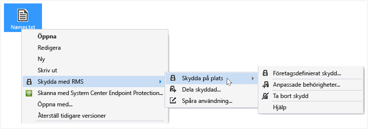
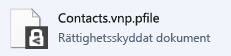

# Skydda en fil p&#229; en enhet (skydda p&#229; plats) genom att anv&#228;nda delningsapplikation Rights Management
När du skyddar en fil på plats, ersätter den ursprungliga, oskyddad fil. Du kan lämna där det är, kopiera den till en annan mapp eller enhet eller dela den mapp som det är och filen förblir skyddade filen. Du kan också koppla skyddad fil i ett e-postmeddelande, även om det rekommenderade sättet att dela en skyddad fil via e-post direkt från filen Explorer eller ett Office-program (se [Skydda en fil som du delar med dig via e-post med hjälp av delningsapplikation Rights Management](../Topic/Protect_a_file_that_you_share_by_email_by_using_the_Rights_Management_sharing_application.md)).

> [!TIP]
> Om du ser eventuella fel när du försöker skydda filer som finns i [vanliga frågor och svar för Microsoft Rights Management dela program för Windows](http://go.microsoft.com/fwlink/?LinkId=303971).

## Skydda en fil på en enhet (skydda på plats)

1.  Välj en fil att skydda filen Explorer. Högerklicka, Välj **skydda med RMS**, och välj sedan **skydda på plats**. Exempel:

    

    > [!NOTE]
    > Om du inte ser de **skydda med RMS** alternativet är det troligt att antingen RMS-delning program inte är installerad på din dator eller måste startas om datorn för att slutföra avinstallationen. Mer information om hur du installerar RMS-delning programmet finns [Hämta och installera delningsapplikation Rights Management](../Topic/Download_and_install_the_Rights_Management_sharing_application.md).

2.  Gör något av följande:

    -   Välj en principmall för: Det här är fördefinierade behörigheter som vanligtvis begränsar åtkomst till och användning till personer i din organisation. Exempel: om organisationsnamnet är "Contoso AB", du kan visa **Contoso AB - konfidentiell Visa endast**. Om du har skyddat en fil på den här datorn måste du först välja **företagsdefinierat skydd** att hämta mallarna.

        Nästa gång du klickar på **skydda på plats** alternativet visas upp till 10 mallar att välja bland. Om det finns fler än 10 tillgängliga mallar och du inte visas klickar du på **företagsdefinierat skydd** att hämta och se alla mallar.

        Du kan också skydda flera filer och en mapp när du väljer en principmall för. När du väljer en mapp skyddas alla filerna i mappen markeras automatiskt skydd men nya filer som du skapar i mappen automatiskt inte.

    -   Välj **anpassade behörigheter**: Välj det här alternativet om mallarna inte tillhandahåller skyddsnivån som du behöver eller vill du uttryckligen ange protection alternativen själv. Ange de alternativ som du vill använda för den här filen i den [protection dialogrutan Lägg till](http://technet.microsoft.com/library/dn574738.aspx), och klicka sedan på **Använd**.

3.  Du kan snabbt se en dialogruta visar att filen skyddas och returnerar fokus till filen Explorer. Den markerade filen eller filer är skyddade nu. I vissa fall (när du lägger till skydd ändrar filnamnstillägget) originalfilen i filen Explorer ersätts med en ny fil som har ikonen Rights Management skydd Lås. Exempel:

    

Om du behöver ta bort skyddet från en fil, visa [Ta bort skyddet från en fil med hjälp av delningsapplikation Rights Management](../Topic/Remove_protection_from_a_file_by_using_the_Rights_Management_sharing_application.md).

## Exempel och andra instruktioner
Exempel på hur du kan använda den Rights Management dela program och instruktioner finns i följande avsnitt från Rights Management delning application användaren guide:

-   [Exempel på hur RMS-delning program](../Topic/Rights_Management_sharing_application_user_guide.md#BKMK_SharingExamples)

-   [Vad vill du göra?](../Topic/Rights_Management_sharing_application_user_guide.md#BKMK_SharingInstructions)

## Se även
[Rights Management delning användaren guide till](../Topic/Rights_Management_sharing_application_user_guide.md)

