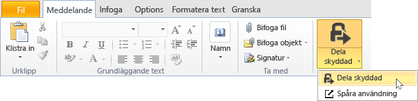
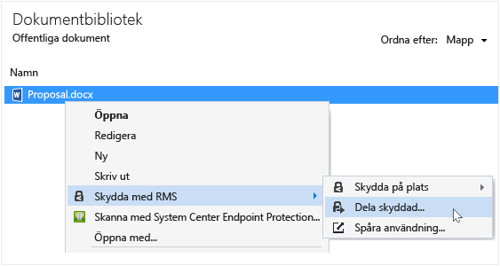
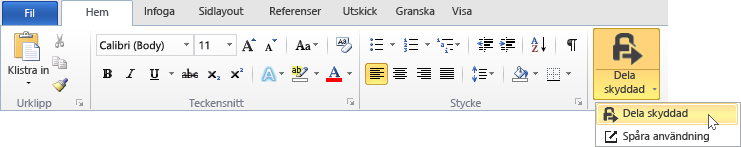
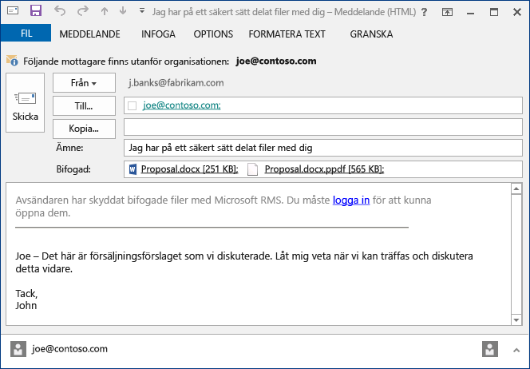

# Skydda en fil som du delar med dig via e-post med hj&#228;lp av delningsapplikation Rights Management
När du skyddar en fil som du delar med dig via e-post, skapas en ny version av originalfilen. Originalfilen förblir oskyddade och den nya versionen är skyddade och automatiskt bifogas ett e-postmeddelande som du skickar sedan.

I vissa fall (för filer som har skapats med Microsoft Word, Excel och PowerPoint) skapar RMS-delning program två versioner av filen som den ansluten till e-postmeddelande. Den andra versionen av filen har ett **.ppdf** filnamnstillägg och det är en PDF-skuggkopia av filen. Den här versionen av filen garanterar att mottagarna kan alltid läsa filen, även om de inte har installerats samma program som användes för att skapa den. Detta är ofta fallet när personer läsa sina e-post på mobila enheter och vill visa sina e-postbilagor. Alla de behöver för att öppna filen är RMS-delning program. Sedan kan de läsa bifogad fil, men de kan inte ändra det innan de öppnar versionen av filen med hjälp av ett program som stöder RMS.

Om din organisation använder Azure RMS, du kan hålla reda på de filer som skyddas genom att dela:

-   Välj ett alternativ för att ta emot e-postmeddelanden när någon försöker öppna dessa skyddade bifogade filer. Varje gång filen öppnas, du kommer att meddelas som försökte öppna filen och när, och om de har installerats (de har autentiserats) eller inte.

-   Använd den dokumentation spårning plats. Du kan även sluta dela filen genom att återkalla åtkomst till den på webbplatsen spårning av dokument. Mer information finns i [Spåra och återkalla dokumenten när du använder RMS-delning program](../Topic/Track_and_revoke_your_documents_when_you_use_the_RMS_sharing_application.md).

## Använda Outlook: Skydda en fil som du delar med dig via e-post

1.  Skapa e-postmeddelande och koppla filen. Klicka sedan på den **meddelande** under den **RMS** klickar **Dela skyddat** och klicka sedan på **Dela skyddat** igen:

    

    Om du inte ser den här knappen är det troligt att antingen RMS-delning program inte är installerad på din dator, den senaste versionen är inte installerad eller måste startas om datorn för att slutföra avinstallationen. Mer information om hur du installerar programmet delning, se [Hämta och installera delningsapplikation Rights Management](../Topic/Download_and_install_the_Rights_Management_sharing_application.md).

2.  Ange de alternativ som du vill använda för den här filen i den [skyddade dialogrutan Dela](http://technet.microsoft.com/library/dn574738.aspx), och klicka sedan på **Skicka nu**.

### Andra sätt att skydda en fil som du delar med dig via e-post
Du kan använda dessa alternativ förutom dela en skyddad fil med Outlook:

-   Från filen Explorer: Den här metoden fungerar för alla filer.

-   Från ett Office-program: Den här metoden fungerar för program som har stöd för RMS-delning programmet med hjälp av Office-tillägg så att du ser den **RMS** gruppen i menyfliksområdet.

##### Använda File Explorer eller ett Office-program: Skydda en fil som du delar med dig via e-post

1.  Använd ett av följande alternativ:

    -   För filen Explorer: Högerklicka på filen, Välj **skydda med RMS**, och välj sedan **Dela skyddat**:

        

    -   För de Office-program, Word, Excel och PowerPoint: Kontrollera att du har sparat filen först. Klicka sedan på den **Start** under den **RMS** klickar **Dela skyddat** och klicka sedan på **Dela skyddat** igen:

        

    Om du inte ser alternativen för skydd, är det troligt att antingen RMS-delning program inte är installerad på din dator, den senaste versionen är inte installerad eller måste startas om datorn för att slutföra avinstallationen. Mer information om hur du installerar programmet delning, se [Hämta och installera delningsapplikation Rights Management](../Topic/Download_and_install_the_Rights_Management_sharing_application.md).

2.  Ange de alternativ som du vill använda för den här filen i den [skyddade dialogrutan Dela](http://technet.microsoft.com/library/dn574738.aspx), och klicka sedan på **Skicka**.

3.  Du kan snabbt se en dialogruta visar att filen skyddas och sedan visas i ett e-postmeddelande skapas som visar mottagarna att bifogade filer är skyddade med Microsoft RMS och att de måste logga in. När de klickar på länken logga in finns instruktioner och länkar så att de kan öppna din skyddade bifogad fil.

    Exempel:

    

    Undrar du: [Vad är .ppdf-fil som skapas automatiskt?](../Topic/Dialog_box_options_for_the_Rights_Management_sharing_application.md#BKMK_PPDF)

4.  Valfritt: Du kan ändra något som du vill använda den här e-postmeddelande. Du kan till exempel lägga till eller ändra ämnet eller texten i meddelandet.

    > [!WARNING]
    > Även om du kan lägga till eller ta bort användare från den här e-postmeddelande, ändras inte behörigheter för den koppling som du angett i den **Dela skyddat** dialogrutan. Om du vill ändra de behörigheterna som till exempel ger en ny person behörighet att öppna filen, Stäng e-postmeddelande utan att spara eller skicka den och gå tillbaka till steg 1.

5.  Skicka e-postmeddelande.

## Exempel och andra instruktioner
Exempel på hur du kan använda den Rights Management dela program och instruktioner finns i följande avsnitt från Rights Management delning application användaren guide:

-   [Exempel på hur RMS-delning program](../Topic/Rights_Management_sharing_application_user_guide.md#BKMK_SharingExamples)

-   [Vad vill du göra?](../Topic/Rights_Management_sharing_application_user_guide.md#BKMK_SharingInstructions)

## Se även
[Rights Management delning användaren guide till](../Topic/Rights_Management_sharing_application_user_guide.md)

