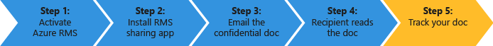

# Snabbstart v&#228;gledning f&#246;r Azure Rights Management
Använd den här kursen att snabbt Prova Microsoft Azure Rights Management (även kallat Azure RMS) för organisationen med bara 5 steg som ska ta mindre än 15 minuter. Du ska aktivera tjänsten, skicka ett säkert sätt konfidentiellt dokument via e-post till någon i en annan organisation och kan spåra när dokumentet öppnas. När konfidentiellt dokument är e-post, är krypterad under överföringen och kan bara läsas av personen som skickas till, med de behörigheter som har angetts av användaren.

Den här kursen syftar IT-administratörer och konsulter, för att utvärdera Azure Rights Management som en information protection lösning för en organisation. Anvisningarna för att aktivera tjänsten skulle göras av en administratör och instruktionerna för att skicka dokumentet skulle göras av slutanvändare i en produktionsmiljö. Båda grupperna av instruktioner ingår i den här kursen att demonstrera slutpunkt till slutpunkt-scenario säker skicka ett konfidentiellt dokument till någon i en annan organisation. Om det uppstår problem med den här kursen kan du skicka ett e-postmeddelande till [AskIPTeam](mailto:askipteam@microsoft.com?subject=Having%20problems%20with%20the%20Quick%20Start%20tutorial) och vi ska hjälpa dig.

Om du vill slutföra den här kursen behöver du följande:

-   En prenumeration som stöder Azure Rights Management. Detta kan vara en betald prenumeration eller en utvärderingsprenumeration. Om du vill använda dokument spårning som krävs i steg 5 i den här handledningen, stöd din prenumeration spårning av dokument. Mer information om Prenumerationsalternativ och länkar till gratis provperioder finns i [Molnet prenumerationer som har stöd för Azure RMS](../Topic/Requirements_for_Azure_Rights_Management.md#BKMK_SupportedSubscriptions) under den [Krav för Azure Rights Management](../Topic/Requirements_for_Azure_Rights_Management.md) ämne.

    Tips: Om du vill få en prenumeration kan du göra detta i förväg eftersom den här processen kan ibland ta lite tid att slutföra.

-   Ett administratörskonto för att logga in på Office 365 Administrationscenter eller Azure-portalen så att du kan aktivera Rights Management-tjänsten. Det här kontot måste även ha en e-postadress och en aktiv e-tjänst (till exempel Exchange Online eller Exchange Server).

-   En dator som kör Windows (minst Windows 7 SP1) och som har installerat Office 2016, Office 2013 eller Office 2010.

Sätt igång.

## Steg 1: Aktivera Rights Management-tjänsten

Även om du kan ha en prenumeration som stöder Azure Rights Management är tjänsten inaktiverad som standard. Du kan använda administrationscentret för Office 365 eller Azure-portalen för att aktivera den:

-   Om du har en Office 365-prenumeration som innehåller Azure Rights Management eller Office 365-prenumeration som undantar Azure Rights Management men du har en prenumeration på Azure RMS fristående: **Använda administrationscentret för Office 365**.

-   Om du inte har en Office 365-prenumeration: **Använda Azure-portalen**.

#### Aktivera Rights Management från administrationscentret för Office 365

1.  Gå till den [Office 365-portalen](https://portal.office.com/) och logga in med ditt konto arbetet eller skolan.

2.  Om inte automatiskt visas administrationscentret för Office 365, välj ikonen starta app i övre vänstra och välj **Admin**. Den **Admin** bricka visas endast för Office 365-administratörer.

    > [!TIP]
    > Mer information om admin center finns [Administrationscenter om Office 365 - administratör hjälp](https://support.office.com/article/About-the-Office-365-admin-center-Admin-Help-58537702-d421-4d02-8141-e128e3703547).

3.  I det vänstra fönstret, expandera **TJÄNSTINSTÄLLNINGARNA**.

4.  Klicka på **Rights Management**.

5.  På den **RIGHTS MANAGEMENT** klickar du på **hantera**.

6.  På den **rights management** klickar du på **Aktivera**.

7.  När du uppmanas **vill du aktivera Rights Management?**, klickar du på **Aktivera**.

Du bör nu visas **Rights management har aktiverats** och möjlighet att inaktivera (du måste kanske uppdatera sidan manuellt)

För närvarande inte på **Avancerade funktioner**. Då kommer du till Azure-portalen där du kan konfigurera mallar som inte behövs för den här kursen. I stället kan du stänga administrationscentret för Office 365.

#### Aktivera Rights Management från Azure-portalen

1.  Gå till den [Azure-portalen](http://go.microsoft.com/fwlink/p/?LinkID=275081) och logga in.

2.  I det vänstra fönstret klickar du på **ACTIVE DIRECTORY**.

3.  Från den **active directory** klickar du på **RIGHTS MANAGEMENT**.

4.  Välj den katalog att hantera för [!INCLUDE[aad_rightsmanagement_2](../Token/aad_rightsmanagement_2_md.md)], klickar du på **Aktivera**, och bekräfta åtgärden.

Den **RIGHTS MANAGEMENT STATUS** ska nu visa **Active** och **Aktivera** alternativet ersätts med **inaktivera**.

Även om du kan konfigurera andra alternativ för Rights Management i portalen, behövs dessa inte för den här kursen så kan du stänga Azure-portalen.

Det är allt du behöver för det här första steget. Tjänsten har aktiverats så att alla användare i organisationen kan nu börja skydda viktiga och känsliga dokument. Du kanske vill begränsa som kan göra detta från början för fasindelad lansering i en produktionsmiljö. Men det är inte nödvändigt för den här kursen.

Även om det inte finns här distribution av tillverkning kan vill du antagligen också förmodligen konfigurera anpassade mallar. Mallar gör det enklare för användare att snabbt använda rätt inställningar när de behöver för att skydda filer. När du aktivera Rights Management kan du få automatiskt 2 standardmallar och är det troligt att du vill komplettera dessa med egna mallar i en produktionsmiljö. Men mallar behövs inte för den här kursen så att du är redo att gå till nästa steg.

|Om du vill ha mer information|Ytterligare information|
|---------------------------------|---------------------------|
|Om Aktivera Rights Management och hur du styr som skyddar aktiverad filer och e-post när tjänsten är →|[Aktivera Azure Rights Management](../Topic/Activating_Azure_Rights_Management.md)|
|Om standardmallar och hur du skapar nya, anpassade mallar →|[Konfigurera anpassade mallar för Azure Rights Management](../Topic/Configuring_Custom_Templates_for_Azure_Rights_Management.md)|

## Steg 2: Installera delningsapplikation Rights Management

Den Rights Management delning (även kallat "appen RMS-delning") är inte ett krav för Azure Rights Management men rekommenderas för alla datorer och mobila enheter som stöder Azure Rights Management. RMS-delning programmet integreras med Office program genom att installera en Office-tillägg så att användarna kan enkelt skydda filer direkt från menyfliksområdet. Det gör det också möjligt att skydda alla filtyper genom att använda allmän skydd för filer som inte stöds av Azure Rights Management och ett dokument spårning webbplats för användare för att spåra och återkalla filer som de har skyddat. Vi kommer att använda dokument spårning plats senare i den här handledningen.

Det här programmet är gratis att hämta och erbjuder en skript installation för tillverkning miljöer. Men för den här handledningen får vi ska installera den lokalt.

#### Hämta och installera delningsapplikation Rights Management

1.  Gå till den [Microsoft Rights Management](http://go.microsoft.com/fwlink/?LinkId=303970) sida på Microsofts webbplats.

2.  I den **datorer** Klicka på ikonen för den **RMS-app för Windows** och spara den **Setup.exe** fil att installera delningsapplikation för Microsoft Rights Management.

3.  För en lokal installation måste du använda ett administratörskonto för att köra filen Setup.exe som hämtades. Om du uppmanas att fortsätta, klickar du på **Ja**.

4.  På den **installationsprogrammet Microsoft RMS** klickar du på **Nästa**, och vänta på att installationen ska slutföras.

5.  När installationen är klar klickar du på **Starta om** om du uppmanas att starta om datorn eller klicka på  **Stäng** att slutföra installationen.

Du är nu redo att börja skyddar filer som innehåller information som du vill dela men bara med personer som du anger.

|Om du vill ha mer information|Ytterligare information|
|---------------------------------|---------------------------|
|Om en lokal installation av den delningsapplikation för Windows och användaren instruktioner → Rights Management|[Rights Management delning användaren guide till](http://technet.microsoft.com/library/dn339006.aspx)|
|Om skript installationen av den delningsapplikation för Windows och ytterligare teknisk information → Rights Management|[Rights Management dela program administratörshandboken](http://technet.microsoft.com/library/dn339003.aspx)|
|Att förstå skillnaden mellan ursprunglig skydd och allmän skydd →|[Vad är skillnaden mellan allmän skydd och inbyggda (intern) skydd?](https://technet.microsoft.com/library/dn574738.aspx)|

## Steg 3: E-dokumentet som du vill skydda

För det här steget först skapa och spara ett dokument med ord som representerar dokumentet som du vill skydda och namnet **Confidential.docx**. Spelar det roll ingen vilken text som den innehåller för den här kursen, men ska det innehåller text så att du enkelt kan bekräfta att auktoriserade mottagaren kan läsa. Exempel: du kan skriva: **Om du kan läsa detta från din e-postmeddelande, har avsändaren har delat en fil som skyddas med Azure RMS.**

Du vill sedan säkert dela dokumentet via e-post.

#### Att på ett säkert sätt dela dokument via e-post

1.  Använda Outlook för att skapa ett nytt meddelande och koppla filen som du skapade.

2.  I den **till** Skriv ett eller flera e-post med business adresser. Kontrollera att du kan ange en e-postadress business som **janetm@contoso.com** eller **p.dover@fabrikam.com** eftersom för närvarande Azure Rights Management har inte stöd för personliga e-postadresser som du kan använda hemma från Internet-leverantör. Oroa dig inte om huruvida den person som du skickar den till också har Azure Rights Management eller inte.

3.  Ange ett ämne som  **konfidentiellt dokument** och Skriv ett kort meddelande för e-post, till exempel **Läs dokumentet konfidentiell och inte dela den med andra.**

4.  Klicka sedan på den **meddelande** under den **RMS** klickar **Dela skyddat** och klicka sedan på **Dela skyddat** igen:

5.  I den **Dela skyddat** dialogrutan:

    1.  Välj **Viewer – endast**.

        Det innebär att våra mottagare kommer att kunna visa dokumentet men inte redigeras eller skriver ut den.

    2.  Välj **e-post mig när någon försöker öppna dokumenten**.

        Om du får ett e-postmeddelande varje gång mottagarna försöker öppna bifogad fil, och även om någon annan försöker öppna den – exempelvis mottagaren vidarebefordrar e-postmeddelandet till medarbetare. I det här senaste scenariot visas att åtkomst nekades och från användarinformation, du kan välja om du vill skicka den personen en kopia av dokument som kan öppnas.

    3.  Välj **Låt mig omedelbart återkalla åtkomst till dessa dokument**.

        Det här alternativet måste mottagarna har Internetanslutning varje gång de öppnar filen med fördelen att om du senare återkalla dokumentet nästa gång de försöker öppna den, de inte kommer att kunna. Om du inte väljer det här alternativet kan mottagarna att kunna öppna den även utan en Internet-anslutning, men med nackdelarna som om du senare återkalla dokumentet det kan vara en fördröjning för då som börjar gälla.

    4.  Klicka på **Skicka nu**.

        E-post med bifogad fil skickas till e-postadresser som du har angett. Förutom ditt e-postmeddelande visas anvisningar så att läsa det bifogade dokument som skyddas av Azure Rights Management.

Nu du har skickat ett skyddat dokument, är du klar att fråga mottagarna ska vänta innan den inkommer och öppna den. Men inte stänga Outlook, eftersom vi ska använda den igen i våra sista steget för att spåra bilagan.

|Om du vill ha mer information|Ytterligare information|
|---------------------------------|---------------------------|
|Fullständiga instruktioner och alternativa metoder för att skydda filer som du delar med e-post →|[Skydda en fil som du delar med dig via e-post med hjälp av delningsapplikation Rights Management](https://technet.microsoft.com/library/dn574735.aspx)|
|Om alternativen i den **Dela skyddat** dialogrutan →|[Dialogrutan för delningsapplikation Rights Management](https://technet.microsoft.com/library/dn574738.aspx)|

## Steg 4: Be mottagarna för att öppna mejl dokument

Mottagarna kan använda många enheter för att läsa skyddat dokument som skickades som ett e-postmeddelande. Enheterna inkludera iPads, iPhones, Android pekplattor och telefoner, Mac-datorer samt Windows-datorer.

Uppmaning om att läsa e-postmeddelande som du har skickat. E-postmeddelande visas innan som följande:

**Avsändaren har skyddade bifogade filer med Microsoft RMS. Måste du** [Logga in](http://aka.ms/rms) **att öppna dem.**

När de klickar på länken det tar dem att instruktionerna för att installera appen RMS-delning och vid behov registrera dig för ett kostnadsfritt konto. Kontot ledigt ger dem en prenumeration för RMS för personer, vilket garanterar att behöriga användare kan alltid läsa ett skyddat dokument, även om deras organisation inte har Azure RMS. De kan sedan läsa skyddade filen med hjälp av följande anvisningar.

#### Visa skyddat dokument bilaga

1.  Eftersom Azure Rights Management skyddas ett Word-dokument, finns det två bilagor i e-postmeddelandet. Det här är verkligen två versioner av samma fil men med olika filnamnstillägg. Öppna den version som har den **.ppdf** filnamnstillägg (**Confidential.ppdf**).

    Om du har en version av [Office på din enhet som stöder Rights Management](https://technet.microsoft.com/library/dn655136.aspx), du kan öppna versionen av filen (**Confidential.docx**), så att den öppnas i Word.

2.  Om du ombeds ange ditt användarnamn och lösenord anger du ditt användarnamn i samma format som e-postadress som användes för att skicka e-post och bifogade filer. Till exempel **janetm@contoso.com** eller **p.dover@fabrikam.com**. Skriv in lösenordet som du angav när du registrerade dig för RMS för personer för ditt lösenord. Eller, om din organisation har Azure RMS lösenord vanliga arbete.

Dokumentet öppnas och du kan nu läsa innehållet. Exempel: du kan säga **om kan du läsa från e-postmeddelande, avsändaren har har delat en fil som skyddas med Azure RMS. det fungerar** Du kan inte ändra innehållet eftersom den är skrivskyddad.

Du kan också be mottagaren att vidarebefordra e-postmeddelandet till andra personer som du inte inkludera i din ursprungliga e-post som ett valfritt steg. Även om de andra fungerar för en organisation som har Azure Rights Management eller de gäller för sina egna RMS för enskilda prenumeration, kan de inte öppna filen. När de är upphöja för sitt användarnamn, kommer att nekas åtkomst till dokumentet.

Nu när mottagaren har öppnat bilagan och eventuellt vidarebefordras den till någon annan, förvänta sig att få ett e-postmeddelande som rapporterar den här aktiviteten. Men e-postmeddelanden som är lätt att bli över tiden, och ett bättre sätt att spåra som nås dokumentet är att använda dokument spårning plats, vilket beskrivs i det sista steget.

|Om du vill ha mer information|Ytterligare information|
|---------------------------------|---------------------------|
|Fullständiga instruktioner för att visa filer som skyddas av Azure Rights Management →|[Visa och använda filer har skyddats av Rights Management](https://technet.microsoft.com/library/dn574741.aspx)|
|Om ledigt prenumerationen RMS för enskilda →|[RMS för personer och Azure Rights Management](../Topic/RMS_for_Individuals_and_Azure_Rights_Management.md)|
|Om båda versionerna av filen kopplat du ser till e-postmeddelande →|[Vad är .ppdf-fil som skapas automatiskt?](https://technet.microsoft.com/library/dn574738.aspx)|

## Steg 5: Spåra ett skyddat dokument

> [!NOTE]
> Du måste ha en prenumeration som stöder dokument spårning för det här steget. Du kan kontrollera om din prenumeration innehåller dokument spårning [erbjudanden för jämförelse av Rights Management Services (RMS)](https://technet.microsoft.com/dn858608.aspx).

Det här steget är valfritt, men de flesta vill du veta mer om bilagan de skickas till personer har öppnats, och även varifrån. Exempel:

-   Du väntar på ett svar från någon av en viss tid och du kan se från webbplatsen dokument spårning hon har öppnat dokumentet även om tidsgränsen snart. Du skickar henne en upp e-post eller telefon henne som en rimlig påminnelse.

-   När Kontrollera att någon har öppnat dokumentet du följa upp be sina om hon har några frågor eller behöver ytterligare information.

#### Att spåra ett skyddat dokument

1.  Använda Outlook på den **Start** under den **RMS** klickar **Spåra användningen**.

2.  Om du ser den **skydda och dela på dina villkor** klickar du på **Logga in** och ange ditt användarnamn och lösenord igen.

3.  På den **delade dokument** sidan ser du dokument som du har kopplat till e-post, **Confidential.docx**. Nu är det endast den filen visas men som du delar ytterligare skyddat dokument listan kommer att växa.

    Från den här sidan visas när du delade dokument (när du har skickat e-post med skyddade bifogad fil), datum för senaste aktiviteten och namnet på den mottagare som du har skickat e-postmeddelande till. Klicka på namnet på mer information.

4.  På den nya sidan som innehåller namnet på filen som du har klickat på visas sammanfattande information om du endast detta dokument och en lista med andra alternativ som är tillgängliga för dokumentet (**lista**, **tidslinje**, **kartan**, **inställningar**).

    Klicka på varje alternativ utforska olika sätt att spåra ett skyddat dokument. Eller fortfarande på den **Sammanfattning** klickar du på **Öppna i Excel** exportera informationen till ett kalkylblad eller klicka på **återkalla åtkomst** sluta dela dokumentet.

Du kan gå tillbaka till den här platsen för att spåra ytterligare aktivitet för ett skyddat dokument eller återkalla åtkomst om det behövs. Du kan även på webbplatsen från en mobil enhet eller tablet, med hjälp av en webbläsare med den här länken: [dokument spårning](http://go.microsoft.com/fwlink/?LinkId=529562)

|Om du vill ha mer information|Ytterligare information|
|---------------------------------|---------------------------|
|Fullständiga instruktioner för att spåra dokument-→|[Spåra och återkalla dokumenten när du använder RMS-delning program](https://technet.microsoft.com/library/dn986611.aspx)|
|Två minut video som förklarar och visar dokumentet spårning →|[Spårning av Azure RMS-dokument och återkallade](http://channel9.msdn.com/Series/Information-Protection/Azure-RMS-Document-Tracking-and-Revocation)|
|För felsökning och kunden frågor →|[Frågor och svar om spårning av dokument](https://technet.microsoft.com/dn947488)|

## Nästa steg
Den här kursen instruktionerna du bara ett scenario för hur Azure RMS kan hjälpa dig att skydda dina data. Om du vill se andra vanliga använder den [Azure RMS aktiv](https://technet.microsoft.com/library/jj585026.aspx) avsnitt från den [Vad är Azure Rights Management?](../Topic/What_is_Azure_Rights_Management_.md) artikeln. Det finns andra avsnitt i den här artikeln kan också vara användbara, till exempel hur Azure RMS fungerar och vilka lösningar den kan lösa.

Om du är redo att börja distribuera Azure RMS, Använd den [Översikt över Azure Rights Management-distribution](../Topic/Azure_Rights_Management_Deployment_Roadmap.md) för din distribution länkarna för instruktioner.

## Se även
[Kom igång med Azure Rights Management](../Topic/Getting_Started_with_Azure_Rights_Management.md)

