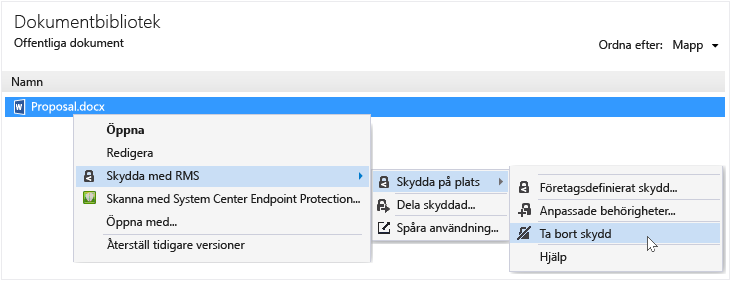

# Ta bort skyddet fr&#229;n en fil med hj&#228;lp av delningsapplikation Rights Management
Ta bort skyddet från en fil (det vill säga ta bort skyddet från en fil) som tidigare skyddas med RMS-delning program ska du använda den **Ta bort skydd** alternativet från filen Explorer.

> [!IMPORTANT]
> Du måste vara en ägare att ta bort skyddet.

### Ta bort skyddet från en fil

1.  Högerklicka på filen (till exempel Sample.ptxt) från filen Explorer markerar **skydda med RMS**, klickar du på **skydda på plats**, och klicka sedan på **Ta bort skydd**:

    

    Du kan ange autentiseringsuppgifter.

Den ursprungliga skyddade filen bort (till exempel Sample.ptxt) och ersätts med en fil som har samma namn, men med oskyddade filnamnstillägget (till exempel Sample.txt).

## Exempel och andra instruktioner
Exempel på hur du kan använda den Rights Management dela program och instruktioner finns i följande avsnitt från Rights Management delning application användaren guide:

-   [Exempel på hur RMS-delning program](../Topic/Rights_Management_sharing_application_user_guide.md#BKMK_SharingExamples)

-   [Vad vill du göra?](../Topic/Rights_Management_sharing_application_user_guide.md#BKMK_SharingInstructions)

## Se även
[Rights Management delning användaren guide till](../Topic/Rights_Management_sharing_application_user_guide.md)

