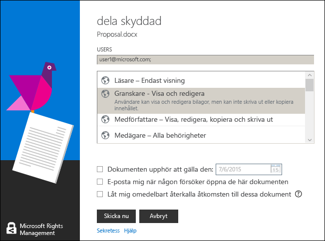

# Omarbetad version 3: Handbok till delningsapplikationen f&#246;r Microsoft Rights Management
Använd den här guiden för Delningsapplikationen för Microsoft Rights Management för Windows för att skydda viktiga dokument och bilder från personer som inte bör se dem, även när du mejlar dem eller sparar dem till en annan enhet. På samma sätt kan du använda det här programmet för att öppna och använda filer som andra har skyddat, genom att använda samma Rights Management-teknik.

Delningsprogrammet tillhandahåller skydd för dina filer på följande sätt:

-   Programmet lägger till funktioner i Utforskaren så att du, när du hanterar filer i en mapp, enkelt kan skydda en enskild fil, flera filer samtidigt eller alla filer i en mapp.

-   Det tillhandahåller skydd för alla filtyper och har ett inbyggt visningsprogram för vanliga text- och bildfiltyper.

-   Det lägger även till knappen **Dela skyddat** i verktygsfältet i Word, PowerPoint och Excel i Microsoft Office.

Allt du behöver är en dator som kör Windows 7 eller Windows 8 och ett lokalt administratörskonto för att installera RMS-delningsprogrammet. Hämta och installera sedan det här kostnadsfria programmet från Microsoft.

Om du har frågor som inte har besvarats av den här guiden kan du besöka [Frågor och svar för Microsoft Rights Management Sharing Application för Windows](http://go.microsoft.com/fwlink/?LinkId=303971).

## Exempel på hur RMS-delningsprogrammet kan användas
Det här är bara några exempel på hur du kan använda RMS-delningsprogrammet för att skydda dina filer.

|Scenario|Lösning som använder RMS-delningsprogrammet|
|------------|-----------------------------------------------|
|**Jag vill kunna kopiera ett konfidentiellt företagsdokument säkert till en annan enhet**<br /><br />Du använder din dator för att arbeta med ett strategidokument som är konfidentiellt inom företaget och vill kopiera det till ett USB-minne så att du kan fortsätta att arbeta med det när du lämnar kontoret och inte har tillgång till företagets nätverk.|Du har RMS-delningsprogrammet installerat både på din stationära dator och på den bärbara datorn. Du kan använda Utforskaren på datorn för att skydda filen genom att använda en mall så att den inte kan användas av personer utanför företaget. Du kan sedan kopiera filen till ditt minne, koppla in minnet på din bärbara dator och fortsätta att arbeta med dokumentet. Ingen utanför företaget kan komma åt dokumentet om du tappar USB-minnet eller om din bärbara dator blir stulen.|
|**Jag vill på ett säkert sätt kunna dela finansiella upplysningar med tillförlitliga personer utanför organisationen**<br /><br />Du arbetar med en partnerföretag och vill maila dem ett Excelkalkylblad som innehåller säljprognoser. Du vill att de ska kunna visa siffrorna men inte ändra dem.|Du använder knappen **Dela skyddat** på menyfliksområdet i Excel, skriver in e-postadresserna till de två personer du arbetar tillsammans med i partnerföretaget, väljer **Granskare** på skjutreglaget och klickar på **Skicka**.<br /><br />När e-postmeddelandet når partnerföretaget kan endast mottagarna i e-postmeddelandet visa kalkylbladet och de kan inte spara, redigera, skriva ut eller vidarebefordra.|
|**Jag behöver kunna skicka en teknisk ritning på ett säkert sätt via e-post till någon som använder en iOS-enhet**<br /><br />Ditt företag använder ett eget konstruktionsprogram och du vill skicka en strikt konfidentiell ritning till en medarbetare som du vet regelbundet läser sin e-post på sin iOS-enhet.|Du använder Utforskaren för att högerklicka på filen och väljer **Dela skyddat**. RMS-delningsprogrammet upptäcker att filnamnstillägget inte kommer från något program som har intern stöd för RMS, så när det bifogar filen till e-postmeddelandet konverterar det automatiskt filen till en fil med allmänt skydd och markerar automatiskt alternativet **Tillåt användning på alla enheter**.<br /><br />Mottagaren tar emot e-postmeddelandet på sin iOS-enhet, klickar på länken i e-postmeddelandet som talar om hur man hämtar RMS-delningsprogrammet, installerar versionen för iOS-enheter och visar ritningen.|
|**Mitt företag använder inte Rights Management, men jag har fått ett e-postmeddelande med en bifogad fil som skyddas av RMS**<br /><br />E-sändaren är någon som du litar på eftersom du har gjort affärer med dem tidigare och du misstänker att de skickar information om ett potentiellt nytt affärstillfälle.|Du klickar på länken i e-postmeddelande som berättar hur du hämtar RMS-delningsprogrammet till datorn, installerar det och registrerar dig för RMS for Individuals. Microsoft bekräftar att din organisation inte har en prenumeration på Office 365, skickar ett e-postmeddelande som slutför den kostnadsfria registreringen. Sedan kan du logga in med ditt nya konto. Sedan kan du öppna den bifogade filen i e-postmeddelandet och läsa om den nya affärsmöjligheten.|

## <a name="BKMK_Install"></a>Så här hämtar du och installerar RMS-delningsprogrammet
> [!IMPORTANT]
> Du måste ha ett lokalt administratörskonto för att kunna installera RMS-delningsprogrammet. Du kan använda alternativet **Kör som administratör** när du kör Setup.exe i steg 3 om du inte är inloggad som lokal administratör.

Om du vill installera RMS-delningsprogrammet följer du de här stegen:

1.  Gå till sidan [Microsoft Rights Management](http://go.microsoft.com/fwlink/?LinkId=303970) på Microsofts webbplats.

2.  Klicka på ikonen för **RMS-program för Windows** i avdelningen **Datorer** och spara installationspaketet för delningsapplikationen Microsoft Rights Managements på din dator.

3.  Dubbelklicka på den hämtade komprimerade filen och dubbelklicka sedan på **setup.exe**. Klicka på **Ja** om du ser en uppmaning.

4.  På sidan **Setup Microsoft RMS** klickar du på **Nästa** och väntar på att installationen ska slutföras.

5.  När installationen är klar klickar du på **Starta om** för att starta om din dator och slutföra installationen. Eller klicka på **Stäng** och starta om din dator senare för att slutföra installationen.

Nu kan du börja skydda dina filer eller läsa filer som andra har skyddat.

## <a name="BKMK_UsingMSRMSApp"></a>Vad vill du göra?
Använd följande anvisningar som hjälper dig att arbeta med skyddade filer.

### <a name="BKMK_CreatePTXT"></a>Skapa en skyddad textfil
Du kan omvandla en vanlig textfil (TXT) till en skyddad fil som har filnamnstillägget .ptxt.

##### Skapa en skyddad textfil (.ptxt)

1.  I Utforskaren högerklickar du i en mapp, klickar på **Nytt** och klickar sedan på **Textdokument**.

2.  Byt namn på filen (till exempel Test.txt).

3.  Dubbelklicka på filen för att öppna den i Anteckningar.

4.  Lägg till några rader text i filen i Anteckningar och spara den. Du kan använda följande som exempeltext.

    ```
    This is a sample text file.
    This is a sample text file.
    This is a sample text file.
    This is a sample text file. 
    This is a sample text file.
    This is a sample text file.
    ```

5.  Högerklicka på filen, klicka på **Skydda på plats** och välj en mall i listan. Om det här är första gången du använder RMS-delningsprogrammet måste du först väja **Företagsskydd** som hämtar mallar för din organisation.

6.  På skärmbilden **Delningsapplikation för Microsoft Rights Management** bekräftar du vilken princip du vill använda, klickar på **Tillämpa** och när filen är skyddad klickar du på **Stäng**.

### <a name="BKMK_ViewPTXT"></a>Visa en skyddad textfil (.ptxt) eller bildfil
Om du vill visa en skyddad textfil dubbelklickar du på filen (till exempel Test.ptxt) i Utforskaren. Du uppmanas att ange autentiseringsuppgifter. När filen öppnas visas filens skyddsprincip längst upp i filen.

Du kan visa och öppna skyddade bilder på samma sätt.

### <a name="BKMK_CreatePFILE"></a>Skapa en fil med allmänt skydd
Använd formatet allmänt skydd (.pfile) för att ge ett allmänt skydd för filtyper som inte direkt stöds av RMS-delningsprogrammet eller andra program som erbjuder inbyggt RMS-skydd. Du kan använda sidan [Microsoft Rights Management](http://go.microsoft.com/fwlink/?LinkId=303970) på Microsofts webbplats för att snabbt kontrollera vilka program som stöder RMS-skydd.

Eftersom Microsoft Visio för närvarande inte stöder inbyggt RMS-skydd kan du använda allmänt skydd för VSD-filer som du skapar med Microsoft Visio.

> [!TIP]
> Vad är skillnaden mellan inbyggt (internt) skydd och allmänt skydd?
> 
> -   När du använder allmänt skydd för en fil kan obehöriga inte öppna filen. Men när behöriga användare har öppnat filen kan de vidarebefordra den oskyddad till andra eller spara den på en plats som andra kan komma åt. De får se ett meddelande längst upp i filen som anger vilka behörigheter de har för filen, och de uppmanas att respektera dessa men skyddet kan inte tvingas. Dessutom kan du inte begränsa behörigheterna ytterligare, mer än att kräva auktorisering, när du använder allmänt skydd. Om du använder anpassade behörigheter väljer skjutreglaget i RMS-delningsprogrammet automatiskt **MEDÄGARE** och du kan inte ändra detta till mer restriktiva behörigheter, som exempelvis **LÄSARE** eller **MEDFÖRFATTARE**.
> -   När du använder det inbyggda RMS-skyddet med program som har stöd för detta (till exempel, Office-filer) är det däremot så att skyddet gäller filen även om den skickas till någon annan eller sparas på en annan plats. När du skyddar filerna kan du också använda begränsade behörigheter som skrivskyddad, eller behörighet att redigera men inte skriva ut eller kopiera. Om du till exempel använder anpassade behörigheter väljer skjutreglaget i RMS-delningsprogrammet automatiskt **GRANSKARE** som behörighet, vilket du sedan kan ändra så att det blir mer eller mindre restriktivt.

##### Exempel: Om du vill skapa ett allmänt skyddad fil (.pfile) från en Visio-ritningsfil (.vsd)

1.  I Utforskaren högerklickar du i en mapp, klickar på **Ny** och klickar sedan på **Nytt Visio-dokument**.

2.  Byt namn på filen (till exempel Prov.vsd).

3.  Dubbelklicka på filen för att öppna den i Visio.

4.  I Visio lägger du till element i ritningen och sparar och stänger sedan filen.

5.  Högerklicka på filen, klicka på **Skydda på plats** och välj en principmall i listan. Om det här är första gången du använder RMS-delningsprogrammet måste du först väja **Företagsskydd** som hämtar mallar för din organisation.

6.  På skärmbilden **Delningsapplikation för Microsoft Rights Management** markerar du den princip du vill tillämpa och klickar sedan på **Tillämpa**.

7.  Ett meddelande visas som talar om att en skyddad fil har sparats som en .pfile-fil (till exempel Test.vsd.pfile). Den ursprungliga filen tas bort.

### <a name="BKMK_ViewPFILE"></a>Visa en (.pfile)-fil med allmänt skydd
För att visa en fil med allmänt skydd (.pfile) dubbelklickar du på den (till exempel Test.vsd.pfile) i Utforskaren och klickar på **Öppna**.

### <a name="BKMK_Unprotect"></a>Ta bort skyddet från en fil
Om du vill ta bort skyddet från en fil (dvs. göra den oskyddad) som tidigare har varit skyddad, använder du alternativet **Ta bort skydd**:

1.  Högerklicka på filen (exempelvis Test.ptxt), klicka på **Skydda på plats** och klicka sedan på **Ta bort skydd**. Du uppmanas att ange autentiseringsuppgifter.

2.  Den ursprungliga skyddade filen bort (till exempel Sample.ptxt) och ersätts med en fil som har samma namn, men med oskyddat filnamnstillägg (till exempel Sample.txt).

### <a name="BKMK_ProtectCustom"></a>Skydda en fil med dina egna anpassade behörigheter
Det enklaste sättet att skydda en fil är att använda mallar, men du kan även ange egna behörigheter. Detta kallas för användarskapat skydd och det är användbart i följande situationer:

-   Du vill begränsa filåtkomsten så att den bara omfattar en viss lista med enskilda användare som identifieras av sina e-postadresser.

-   Du vill begränsa användningen av filen till endast specifika rättigheter, till exempel läsrättigheter till ett dokument.

För att skydda en fil med användarskapade behörigheter högerklickar du på filen, klickar på **Skydda på plats** och klickar sedan på **Anpassade behörigheter**. Följande skärmbild visas:


Skriv in e-postadresserna till användarna och använd skjutreglaget för att välja behörigheter till filen. Klicka sedan på **Använd**.

### <a name="BKMK_UserDefined"></a>Använda filer som har anpassat skydd
De flesta skyddade filer du öppnar har skyddats med hjälp av mallar. Användare kan dock även skydda filer med hjälp av sina egna anpassade behörigheter, vilket kallas för användarskapat skydd.

För text- och bildfilformat kräver den här skyddsnivån att alla program du använder för att redigera, spara eller begränsa filerna ska vara gjorda för att stöda RMS-skydd och att de implementerar skydds-API:erna som tillhandahålls i AD RMS SDK.

När du visar en skyddad textfil som har användarskapat skydd, ser du en viss skillnad i hur behörigheterna för filen visas, enligt följande exempel.

För filer som skyddas med hjälp av filformatet för allmänt skydd (.pfile), visas särskilda rättigheter eller behörigheter som har angetts av användaren på bekräftelseskärmen i stället för namnet på den mall som användes för att skydda filen, vilket  visas i följande bild.


### <a name="BKMK_ShareProtected"></a>Skydda innehåll som ska delas via e-post
Om du vill skydda innehåll som du ska dela via e-post högerklickar du på filen och klickar på **Dela skyddat** Följande skärmbild visas:


Skriv in e-postadresserna till användarna i listan och använd skjutreglaget för att välja behörigheter till filen. Klicka sedan på **Skicka**. Outlook skapar ett e-postmeddelande för mottagarna med ett kort meddelande som du kan ändra, och bifogar den skyddade filen. Den ursprungliga filen är inte skyddad.

För att göra så att skyddade filer kan visas på enheter med andra operativsystem än Windows klickar du på **Tillåt användning på alla enheter**. Användare kanske måste hämta RMS-delningsprogrammet för sin enhet och det finns en länk till det i e-postmeddelandet.

### <a name="BKMK_Multiple"></a>Använd skydd på flera filer och mappar
Du behöver inte tillämpa skydd på filerna en och en när du använder Utforskaren. Du kan i stället markera flera filer eller alla filer i en mapp, om dessa filer inte redan är skyddade.

##### Så här skyddar du flera eller alla filer i en angiven mapp

1.  Markera flera filer i Utforskaren, eller välj en mapp som innehåller filer som ska vara skyddade.

2.  Högerklicka på mappen eller filen, klicka på **Skydda på plats** och välj en mall i listan. Om det här är första gången du använder RMS-delningsprogrammet måste du först väja **Företagsskydd** som hämtar mallar för din organisation.

3.  På skärmbilden **Delningsapplikation för Microsoft Rights Management** bekräftar du att filerna har skyddats.

> [!TIP]
> Om du ser några fel kan du läsa mer i [FAQ for Microsoft Rights Management Sharing Application for Windows](http://go.microsoft.com/fwlink/?LinkId=303971).

### <a name="BKMK_OfficeToolbar"></a>Använda tillägget för Office-verktygsfältet
Du kan skydda och dela filer som finns i Word, PowerPoint och Excel direkt från Microsoft Office med tillägget för menyfliksområdet i Office för Delningsapplikationen för Microsoft Rights Management

I gruppen **Skydd** klickar du på **Dela skyddat** för att starta Delningsapplikationen för Microsoft Rights Management.


### <a name="BKMK_AccessKeys"></a>Använda kortkommandon
Tryck på **Alt**-tangenten för att se tillgängliga åtkomsttangenter och tryck sedan på **Alt** + åtkomsttangenten för att välja ett alternativ.

Exempel: i dialogrutan **Dela skyddat** trycker du på **Alt** för att se snabbtangenterna och trycker sedan på **Alt + u** för att markera kryssrutan **Användare måste logga in varje gång de öppnar den här filen**



## Se även
[Hämta delningsapplikationen Microsoft Rights Management](http://go.microsoft.com/fwlink/?LinkId=303970)
 [Vanliga frågor och svar för delningsapplikationen Microsoft Rights Management för Windows](http://go.microsoft.com/fwlink/?LinkId=303971)

