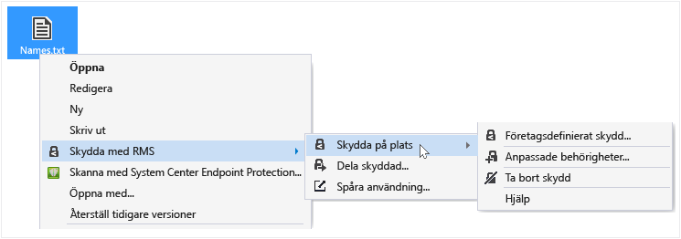
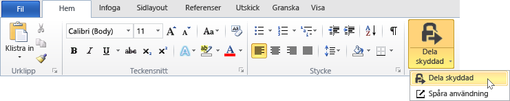

# Anv&#228;ndarhandbok f&#246;r delningsapplikationen f&#246;r Rights Management – &#228;ndring av ett avsnitt
Med delningsapplikationen Microsoft Rights Management (RMS) för Windows kan skydda du viktiga dokument och bilder från personer som inte bör se dem, även om du e-dem eller spara dem till en annan enhet. Du kan också använda det här programmet för att öppna och använda filer som andra har skyddat genom att använda samma Rights Management-teknik.

Allt du behöver för att installera RMS-delning är en dator som kör minst Windows 7 och ett lokalt administratörskonto. Sedan är det bara att [hämta och installera](http://go.microsoft.com/fwlink/?LinkId=303970) det här gratisprogrammet från Microsoft.

Om du har frågor som inte har besvarats av den här guiden kan du besöka [Frågor och svar för Microsoft Rights Management Sharing Application för Windows](http://go.microsoft.com/fwlink/?LinkId=303971).

Här är några exempel på hur du kan använda delningsapplikationen för att skydda dina filer.

|Jag vill...|Gör så här|
|---------------|--------------|
|**... på ett säkert sätt dela finansiell information med en tillförlitlig person som är utanför organisationen**  Du arbetar med en partnerföretag och vill maila dem ett Excelkalkylblad som innehåller säljprognoser. Du vill att de ska kunna visa siffrorna men inte ändra dem.|Du kan använda knappen Dela skyddat i menyfliksområdet i Excel och skriva in e-postadresser för de två personerna från partnerföretaget som du arbetar med. Välj sedan Visningsprogram på skjutreglaget och klicka på Skicka.  När e-postmeddelandet når partnerföretaget kan endast mottagarna i e-postmeddelandet visa kalkylbladet och de kan inte spara, redigera, skriva ut eller vidarebefordra.  Detaljer: Se **Skydda en fil som delas med e-post** i avsnittet  [What do you want to do?](../Topic/Rights_Management_sharing_application_user_guide_-_revision_for_single_topic.md#BKMK_UsingMSRMSApp) i den här guiden.|
|**... på ett säkert sätt skickar ett dokument via e-post till någon som använder en iOS-enhet**  Du vill maila ett-strikt konfidentiellt Word-dokument till en medarbetare som du vet regelbundet kontrollerar sin e-post på sin iOS-enhet.|Högerklicka på filen i Filutforskaren och väl Dela skyddat. I RMS-delningsapplikationen väljer du alternativet Tillåt användning på alla enheter och skickar filen som en bifogad fil till dina kollegor.  Mottagaren tar emot e-postmeddelandet på sin iOS-enhet, klickar på länken i e-postmeddelandet som visar hur delningsapplikationen hämtas, installerar versionen för iOS-enheter och visar dokumentet.  Detaljer: Se **Skydda en fil som delas med e-post** i avsnittet  [What do you want to do?](../Topic/Rights_Management_sharing_application_user_guide_-_revision_for_single_topic.md#BKMK_UsingMSRMSApp) i den här guiden.|
|**... läsa en bifogad fil som jag har fått i ett e-postmeddelande med en bifogad fil som är säkert delad men jag kan inte läsa den eftersom mitt företag inte använder Rights Management**  E-sändaren är någon som du litar på eftersom du har gjort affärer med dem tidigare och du misstänker att de skickar information om ett potentiellt nytt affärstillfälle.|Följ instruktionerna i e-postmeddelandet och klicka på länken för att registrera dig för Microsoft Rights Management. Microsoft bekräftar att din organisation inte har en prenumeration på Office 365, skickar ett e-postmeddelande som slutför den kostnadsfria registreringen. Sedan kan du logga in med ditt nya konto. Du klickar på den andra länken i e-postmeddelandet för att installera delningsapplikationen Rights Management. Sedan kan du öppna den bifogade filen och läsa om den nya affärsmöjligheten.  Detaljer: Se **Visa och använd filer som har skyddats av Rights Management** i avsnittet [What do you want to do?](../Topic/Rights_Management_sharing_application_user_guide_-_revision_for_single_topic.md#BKMK_UsingMSRMSApp) i den här guiden.|
|**... skydda företagets konfidentiella filer på min bärbara dator så att de inte kan användas av personer utanför mitt företag**  Du reser mycket och använder din bärbara dator för att hämta och uppdatera filer i en mapp som måste skyddas mot obehörig åtkomst.|Du har RMS-delning programmet installerat på datorn. Du kan använda Utforskaren för att skydda filer med hjälp av en mall som snabbt skyddar filerna. Om din bärbara dator blir stulen kan du vara trygg i förvissningen om att ingen utanför företaget kan komma åt dessa dokument.  Detaljer: Se **Skydda en fil på en enhet (skydda på plats)** i avsnittet  [What do you want to do?](../Topic/Rights_Management_sharing_application_user_guide_-_revision_for_single_topic.md#BKMK_UsingMSRMSApp) i den här guiden.|

## Vad vill du göra?
Använd följande anvisningar som hjälper dig att arbeta med skyddade filer.

### Hämta och installera delningsapplikationen Rights Management

1.  Gå till sidan [Microsoft Rights Management](http://go.microsoft.com/fwlink/?LinkId=303970) på Microsofts webbplats.

2.  Klicka på ikonen för **RMS-program för Windows** i avdelningen **Datorer** och spara installationspaketet för delningsapplikationen Microsoft Rights Managements på din dator.

3.  Dubbelklicka på den hämtade komprimerade filen och dubbelklicka sedan på **setup.exe**. Klicka på **Ja** om du ser en uppmaning.

    > [!TIP]
    > Du kan behöva bläddra längst ner på listan i den aktuella mappen för att se **setup.exe**.

4.  På sidan **Setup Microsoft RMS** klickar du på **Nästa** och väntar på att installationen ska slutföras.

5.  När installationen är klar klickar du på **Starta om** för att starta om din dator och slutföra installationen. Eller klicka på **Stäng** och starta om din dator senare för att slutföra installationen.

Nu kan du börja skydda dina filer eller läsa filer som andra har skyddat.

#### Mer information
Du måste ha ett lokalt administratörskonto för att installera delningsapplikationen. Du kan använda alternativet **Kör som administratör** när du kör Setup.exe i steg 3 om du inte är inloggad som lokal administratör.

### Skydda en fil på en enhet (skydda på plats)

1.  Välj en fil, en mapp eller flera filer som ska skyddas i Utforskaren. Högerklicka och välj **Skydda på plats**. Till exempel:

    

    > [!NOTE]
    > Om du inte kan se alternativet **Skydda på plats** är det sannolikt att delningsapplikationen inte har installerats på din dator eller att din dator måste startas om för att slutföra installationen. Se anvisningarna i **Hämta och installera delningsapplikationen Rights Management** i avsnittet [What do you want to do?](../Topic/Rights_Management_sharing_application_user_guide_-_revision_for_single_topic.md#BKMK_UsingMSRMSApp) i den här guiden för mer information om hur du installerar delningsapplikationen.

2.  Gör något av följande:

    -   Välj en principmall: Det här är fördefinierade behörigheter som begränsar åtkomst och användning till personer i din organisation. Om detta är första gången du skyddar en fil på den här datorn måste du först välja **Företagsdefinierat skydd** för att ladda ner mallar. Namnet på mallarna börjar med företagets namn och ett beskrivande namn på behörigheten. Till exempel: **Contoso - Endast konfidentiell vy**

    -   Välj **Anpassade behörigheter**: Välj det här alternativet om mallarna inte tillhandahåller skyddsnivån som du behöver. Exempel: du vill ge åtkomst till personer utanför organisationen eller du vill bestämma skyddsalternativen personligen. Ange alternativen för filen i dialogrutan **lägg till skydd** och klicka på **Verkställ**.

        > [!NOTE]
        > Se anvisningarna i **Ange alternativ för dialogrutan Rights Management** i avsnittet [What do you want to do?](../Topic/Rights_Management_sharing_application_user_guide_-_revision_for_single_topic.md#BKMK_UsingMSRMSApp) i den här guiden för mer information om alternativen i dialogrutan.

3.  Ibland visas en dialogruta snabbt som anger att filen skyddas innan du återgår till Utforskaren. Den valda filen eller filerna är nu skyddade. I vissa fall (när skyddet ändrar filnamnstillägget) ersätts originalfilen i Utforskaren med en ny fil som har låsikonen för Rights Management. Till exempel:

    

Om du behöver ta bort skyddet från en fil, se anvisningarna **Ta bort skydd från en fil** i avsnittet [What do you want to do?](../Topic/Rights_Management_sharing_application_user_guide_-_revision_for_single_topic.md#BKMK_UsingMSRMSApp) i den här guiden.

#### Mer information
När du skyddar en fil på plats, ersätts den ursprungliga, oskyddade filen. Du kan lämna filen där den är, kopiera den till en annan mapp eller enhet eller dela mappen – filen förblir skyddad. Du kan även bifoga den skyddade filen i ett e-postmeddelande. Den rekommenderade metoden för delning av en skyddad fil via e-post är direkt från Utforskaren eller med ett Officeprogram (se **Skydda en fil som delas via e-post** i avsnittet [What do you want to do?](../Topic/Rights_Management_sharing_application_user_guide_-_revision_for_single_topic.md#BKMK_UsingMSRMSApp) i den här guiden).

Du kan använda samma metod för att skydda flera filer på åtgången eller en mapp. När du skyddar en mapp skyddas alla filerna i mappen. Nya filer som skapas i mappen skyddas inte automatiskt.

I händelse av fel när du försöker skydda filerna, se [Frågor och svar för Microsoft Rights Management Sharing Application för Windows](http://go.microsoft.com/fwlink/?LinkId=303971).

### Skydda en fil som delas via e-post

1.  Välj ett av följande alternativ:

    -   För Utforskaren: Högerklicka på filen och välj **Dela skyddad**:

        

    -   För Office-program: Kontrollera att du först har sparat filen. Klicka sedan på **Dela skyddad** i gruppen **Skydd**.

        

    > [!NOTE]
    > Om du inte kan se alternativen för delningsskydd är det sannolikt att delningsapplikationen inte har installerats på din dator eller att din dator måste startas om för att slutföra installationen. Se anvisningarna i **Hämta och installera delningsapplikationen Rights Management** i avsnittet [What do you want to do?](../Topic/Rights_Management_sharing_application_user_guide_-_revision_for_single_topic.md#BKMK_UsingMSRMSApp) i den här guiden för mer information om hur du installerar delningsapplikationen.

2.  Ange alternativen för filen i dialogrutan **Dela skyddad** och klicka på **Skicka**.

    

    > [!NOTE]
    > Se anvisningarna i **Ange alternativ för dialogrutan Rights Management** i avsnittet [What do you want to do?](../Topic/Rights_Management_sharing_application_user_guide_-_revision_for_single_topic.md#BKMK_UsingMSRMSApp) i den här guiden för mer information om alternativen i dialogrutan.

3.  Ibland visas en dialogruta snabbt som informerar om att filen är skyddad. Därefter ser du ett e-postmeddelande där ämnet **Jag har delat en fil/filer säkert med dig** har skapats automatiskt. I den här e-postmeddelande är filen som du valt bifogad och skyddad och texten i e-postmeddelandet innehåller länkar till följande:

    -   RMS för personer

    -   RMS-delningsapplikation

    -   Den här användarguiden

    Exempel:

    

4.  Valfritt: Du kan ändra fritt i det här e-postmeddelandet. Du kan till exempel lägga till eller ändra ämnet eller texten i meddelandet.

    > [!WARNING]
    > Även om du kan lägga till och ta bort personer från e-postmeddelandet innebär inte det att behörigheterna som du angav i dialogrutan **dela skyddad** ändras. Om du vill ändra de behörigheterna, till exempel gr en ny person behörighet att öppna filen, måste du stänga e-postmeddelandet utan att spara eller skicka och återgå till steg 1.

5.  Skicka e-postmeddelande.

#### Mer information
När du skyddar en fil som du delar via e-post, skapas en ny version av originalfilen. Originalfilen förblir oskyddade och den nya versionen är skyddad och bifogas automatiskt till ett e-postmeddelande som du sedan skickar.

E-postmeddelandets meddelande och ämne fylls i automatiskt. Du kan ändra dem innan du skickar meddelandet.

Det finns två sätt att skydda en fil som du delar via e-post:

-   Från Utforskaren: Den här metoden fungerar för alla filer.

-   Från ett Office-program: Den här metoden fungerar för applikationer som stöds av delningsapplikationen Rights Management. Du använder gruppen **Skydd** i menyfliksområdet i Office-tillägget.

> [!NOTE]
> I den här versionen av delningsapplikation Rights Management finns inget tillägg för Outlook som låter dig skydda filer och e-postmeddelanden direkt från Outlook. Använd i stället proceduren i det här avsnittet.

### Visa och använda filer har skyddats av Rights Management

#### Så här visar du en skyddad fil
Dubbelklicka på den skyddade filen i Utforskaren eller e-postmeddelande som innehåller bilagan och ange autentiseringsuppgifter om du uppmanas att göra det. Hur filen öppnas beror på hur den skyddas.

-   Om filen är allmänt skyddad (det har filnamnstillägget .pfile):

    Du ser dialogrutan **skyddad fil** från delningsapplikationen som visar vem som skyddade filen och informerar dig om dina skyldigheter som delägare. Du informeras om att åtgärden granskas när du öppnar filen.

    

    Klicka på **Öppna** för att läsa filen.

-   Om filen är skyddades internt (det har inte filnamnstillägget .pfile):

    Filen öppnas med det program som är associerat med det ursprungliga filnamnstillägget och en begränsningslist visas överst i filen. Listen kan visa de behörigheter som tillämpas på filen eller den kan innehålla en länk för att visa dem. Exempel: du kan se följande där du måste klicka på **Behörighet är tillfälligt begränsad** för att visa vilka behörigheter som tillämpas på filen och vilka personer som har åtkomst till den:

    

    Den här filen granskas också och förblir granskad så länge den är skyddad.

##### Mer information
Innan du kan visa den skyddade filen måste RMS först bekräfta att du har behörighet att visa filen genom att kontrollera ditt användarnamn och lösenord. I vissa fall kan dessa vara cachelagrade och du uppmanas inte att ange dina autentiseringsuppgifter. I annat fall uppmanas du att ange dina autentiseringsuppgifter.

Om din organisation inte använder Windows Azure Rights Management (Windows Azure RMS) eller AD RMS kan du begära ett kostnadsfritt konto som accepterar dina autentiseringsuppgifter så att du kan öppna filer som skyddas med hjälp av RMS. Klicka på länken för att ansöka om [RMS för individer](http://go.microsoft.com/fwlink/?LinkId=309469).

#### Använda filer som har skyddats (till exempel, redigera och skriva ut filen)
Om den skyddade filen har filnamnstillägget .pfile:

-   Spara den öppna filen och ge den ett nytt filnamnstillägg som är associerat med det program som du vill använda.

    Om en fil har skyddats med filnamnet document.vsdx.pfile kan du visa filen och spara den i Utforskaren som document.vsdx.

    Den nya filen är inte längre skyddad. Om du vill skydda den måste du göra detta manuellt. Du hittar anvisningar i **Skydda en fil på en enhet (skydd på plats) med delningsapplikationen Rights Management** i avsnittet [What do you want to do?](../Topic/Rights_Management_sharing_application_user_guide_-_revision_for_single_topic.md#BKMK_UsingMSRMSApp) i den här guiden.

Om den ursprungliga skyddade filen inte har filnamnstillägget .pfile:

-   Du kan göra något än visa filen om du inte har ett program som förstår Rights Management. Dessa program kallas för upplysta program för Rights Management. Program från Office 2013 och Office 2010 (t.ex. Word, Excel, PowerPoint och Outlook) är exempel på program som är upplysta för Rights Management. Men program som inte kommer från Microsoft, till exempel andra programvaruföretag och era egna branschspecifika program kan också vara upplysta för Rights Management.

    Program som är upplysta för Rights Management kan öppna filer som har skyddats av andra upplysta Rights Management-program. Dessutom kvarstår skyddet, även om du redigerar filen eller sparar den med ett annat filnamn eller på en annan plats. Med dessa program kan du använda filen enligt de behörigheter som tillämpas på filen. Om du har behörighet att använda filen kan du göra detta. Till exempel om filen är skrivskyddat kommer du inte att kunna göra ändringar eller skriva ut filen.

### Ta bort skyddet från en fil
Gå till utforskare, högerklicka på filen (till exempel Sample.ptxt), klicka på **Skydda på plats** och klicka på **Ta bort skydd**:

Du uppmanas att ange autentiseringsuppgifter.

#### Mer information
Den ursprungliga skyddade filen bort (till exempel Sample.ptxt) och ersätts med en fil som har samma namn, men med oskyddat filnamnstillägg (till exempel Sample.txt).

Använd alternativet **Ta bort skydd** från filutforskaren om du vill ta bort skydd från en fil (d.v.s. göra en fil oskyddad) som tidigare har skyddats av RMS-delningsapplikationen.

> [!IMPORTANT]
> Du måste vara en filägare att ta bort skyddet.

### Använda kortkommandon i delningsapplikationen Rights Management
Tryck på **Alt**-tangenten för att se tillgängliga åtkomsttangenter och tryck sedan på **Alt** + åtkomsttangenten för att välja ett alternativ.

#### Mer information
Exempel: i dialogrutan **dela skyddad** trycker du på **Alt** för att visa åtkomsttangenter och därefter **Alt + u** för att markera kryssrutan **Användare måste logga in varje gång de öppnar filen**.

### Ange alternativ i dialogrutan Rights Management

|Alternativ|Beskrivning|
|--------------|---------------|
|**USERS**|Ange e-postadresser för de personer som du vill ska kunna öppna filen. Använd semikolon för flera adresser. Det kan vara e-postadresser inom din organisation eller utanför.  Till exempel: janetm@contoso.com; pdover@fabricom.com|
|**Tillåt användning på alla enheter**|När du väljer det här alternativet som låter användare öppna filen på mobila enheter som iPad anges behörigheten automatiskt som **CO-OWNER** (samtliga behörigheter), vilket innebär att allmänt skydd tillämpas på filen.|
|**BEHÖRIGHETER**|Flytta skjutreglaget till den behörighet som du vill använda för den här filen.  I vissa fall kan behörigheterna som ställs in automatiskt till CO-OWNER och kan inte ändras. Detta sker om du markerar **Tillåt användning på alla enheter**. Det händer även om du skyddar en fil som inte kan skyddas internt av RMS och  därmed måste tilldelas allmänt skydd. Delningsapplikationen gör detta baserat på filnamnstillägget. **Tip:** Du kan använda sidan [Microsoft Rights Management](http://go.microsoft.com/fwlink/?LinkId=303970) på Microsofts webbplats för att snabbt kontrollera vilka program som stöder inbyggt skydd.|
|**Användarna måste logga in varje gång de öppnar den här filen**|Välj det här alternativet om du behöver högre säkerhet för en fil eftersom den kräver att de användare som du specificerar autentiseras varje gång de ges åtkomst till filen. Om deras autentiseringsuppgifter inte är cachelagrade måste de ange sitt användarnamn och lösenord för att komma åt filen. Den här inställningen kräver dock att användarna alltid har internetanslutning när de öppnar filen. Det kan vara frustrerande att ständigt uppmanas att ange uppgifter och vänta på att autentiseringsprocessen slutförs.|
|**Innehållet upphör att gälla**|Välj endast det här alternativet för viktiga filer om du vill att användarna inte ska kunna öppna filen efter ett visst datum. Du kommer fortfarande att kunna öppna originalfilen.|

#### Mer information
Använd tabellen för att specificera alternativen i dialogrutan **lägg till skydd** eller dialogrutan **dela skyddad** i delningsapplikationen. Den här dialogrutan visas när du skyddar en fil på plats och väljer anpassade behörigheter eller när du skyddar en fil som ska delas.

Se avsnittet [What do you want to do?](../Topic/Rights_Management_sharing_application_user_guide_-_revision_for_single_topic.md#BKMK_UsingMSRMSApp) i den här guiden för mer information om hur du skyddar en fil på plats och skyddar en fil som ska delas.

## Se även
[Rights Management dela program administratörshandboken](../Topic/Rights_Management_sharing_application_administrator_guide.md)
 [Hämta delningsapplikationen Microsoft Rights Management](http://go.microsoft.com/fwlink/?LinkId=303970)
 [Vanliga frågor och svar för delningsapplikationen Microsoft Rights Management för Windows](http://go.microsoft.com/fwlink/?LinkId=303971)

