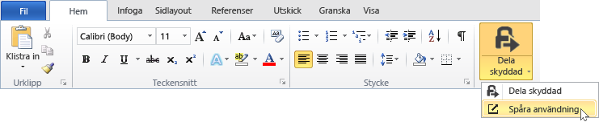
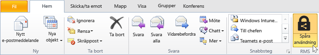
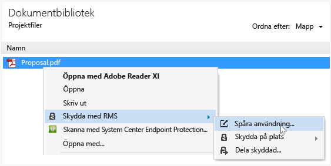
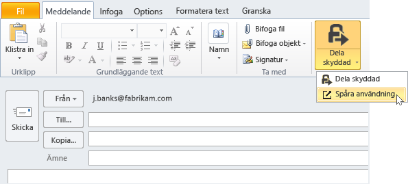

# Sp&#229;ra och &#229;terkalla dokumenten n&#228;r du anv&#228;nder RMS-delning program
När du har skyddat dokumenten genom att använda RMS-delningsprogrammet om din organisation använder Azure Rights Management i stället för Active Directory Rights Management Services, kan du spåra hur personer använder de skyddade dokumenten. Om det behövs kan du även återkalla åtkomst till dessa dokument när du vill sluta dela dem. Om du vill göra detta måste du använda den **dokument plats**, som du kan komma åt från Windows-datorer, Mac-datorer, och även från surfplattor och telefoner.

> [!TIP]
> Två minut video: [Spårning av Azure RMS-dokument och återkallade](http://channel9.msdn.com/Series/Information-Protection/Azure-RMS-Document-Tracking-and-Revocation)

När du har åtkomst till den här platsen kan du logga in att spåra dokumenten. Ger din organisation har ett [prenumeration som har stöd för spårning av dokument och återkallade](https://technet.microsoft.com/dn858608.aspx) och du har tilldelats en licens för den här prenumerationen kan du se vem som försökte öppna filer som du skyddat och om de har lyckats (de har autentiserats) eller inte. Varje gång de försökte komma åt dokumentet och deras plats samtidigt. Dessutom:

-   Om du vill sluta dela ett dokument: Klicka på **återkalla åtkomst**, notera tidsperioden som dokumentet kommer att vara tillgängliga och bestämmer om låta andra få veta att du spärrar åtkomst till dokumentet du tidigare delade och ange en anpassad meddelande.

-   Om du vill exportera till Excel: Klicka på **Öppna i Excel**, så att du kan sedan ändra data och skapa egna vyer.

-   Om du vill konfigurera e-postaviseringar: Klicka på **inställningar** och välj hur och om ska skickas när dokumentet används.

-   Om du har frågor eller vill ge feedback om dokumentet spårning webbplats: Klicka på ikonen hjälp att komma åt den [vanliga frågor och svar för att spåra dokument](http://go.microsoft.com/fwlink/?LinkId=523977).

## Använda Office att spåra plats

-   För de Office-program, Word, Excel och PowerPoint: På den **Start** under den **RMS** klickar **Dela skyddat**, och klicka sedan på **Spåra användningen**.

    

-   Outlook: På den **Start** under den  **RMS** klickar **Spåra användningen**:

    

Om du inte ser alternativen för RMS är det troligt att antingen RMS-delning program inte är installerad på din dator, den senaste versionen är inte installerad eller måste startas om datorn för att slutföra avinstallationen. Mer information om hur du installerar programmet delning, se [Hämta och installera delningsapplikation Rights Management](../Topic/Download_and_install_the_Rights_Management_sharing_application.md).

### Andra sätt att spåra och återkalla dokument
Förutom spåra dokumenten på Windows-datorer med hjälp av Office-program, kan du även använda dessa alternativ:

-   **Med en webbläsare**: Den här metoden fungerar för alla enheter som stöds.

-   **Utforskaren i filen**: Den här metoden fungerar för Windows-datorer.

-   **Med ett Outlook e-postmeddelande**: Den här metoden fungerar för Windows-datorer.

##### Med hjälp av en webbläsare på dokument spårning av webbplatsen

-   Med hjälp av en webbläsare som stöds går du till den [dokument spårning webbplats](http://go.microsoft.com/fwlink/?LinkId=529562).

    Webbläsare som stöds: Vi rekommenderar att du använder Internet Explorer som är minst version 10, men du kan använda någon av följande webbläsare för att använda dokument spårning webbplats:

    -   Internet Explorer: Minst version 10

    -   Internet Explorer 9 med minst MS12-037: Kumulativ säkerhetsuppdatering för Internet Explorer: Den 12 juni 2012

    -   Mozilla Firefox: Minst version 12

    -   Apple Safari 5: Minst version 5

    -   Google Chrome: Minst version 18

##### Filen Utforskaren att komma åt dokument spårning plats

-   Högerklicka på filen, Välj **skydda med RMS**, och välj sedan **Spåra användningen**:

    

##### Med hjälp av ett Outlook e-postmeddelande doc spårning av webbplatsen

-   I ett e-postmeddelande i den **meddelande** under den  **RMS** klickar **Dela skyddat**, och klicka sedan på **Spåra användningen**:

    

## Exempel och andra instruktioner
Exempel på hur du kan använda den Rights Management dela program och instruktioner finns i följande avsnitt från Rights Management delning application användaren guide:

-   [Exempel på hur RMS-delning program](../Topic/Rights_Management_sharing_application_user_guide.md#BKMK_SharingExamples)

-   [Vad vill du göra?](../Topic/Rights_Management_sharing_application_user_guide.md#BKMK_SharingInstructions)

## Se även
[Rights Management delning användaren guide till](../Topic/Rights_Management_sharing_application_user_guide.md)

