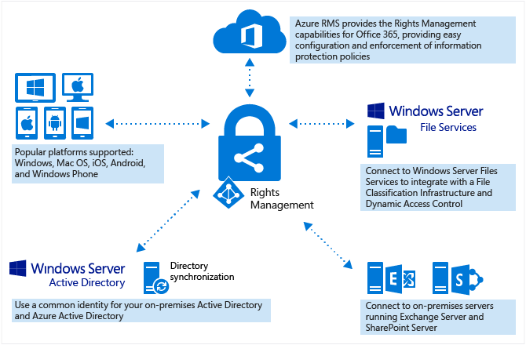
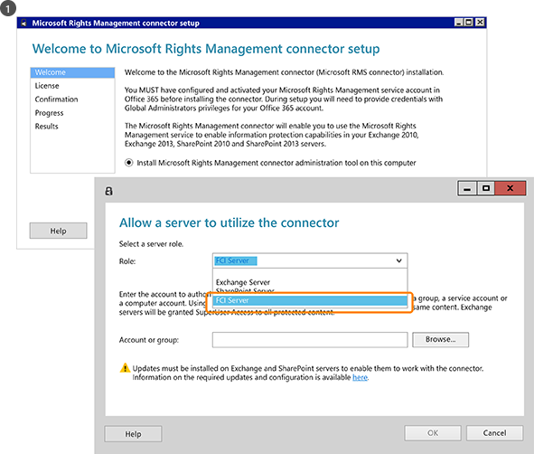
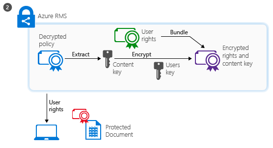

# Vad &#228;r Azure Rights Management?
Azure Rights Management (Azure RMS) är en lösning för skydd av information för organisationer som vill skydda sina data i dagens utmanande arbetsmiljö.

De här utmaningarna är behovet av att vara Internet-anslutna användare föra personlig enhet fungerar, åtkomst till företagsdata på väg och hem och dela känslig information med viktiga affärspartner. Som en del av deras dagligen, användare delar information med e-post, fildelning platser och molntjänster. I dessa scenarion har traditionell säkerhetsåtgärder (till exempel åtkomstkontrollistor och NTFS-behörigheter) och brandväggar begränsad effektivitet om du vill skydda företagets data medan fortfarande din ger användarna möjlighet att arbeta effektivt.

Jämförelse kan Azure RMS skydda ditt företags känslig information i dessa scenarion. Kryptering och identitet auktoriseringsprinciper används för att skydda dina filer och e-post och den fungerar över flera enheter – telefoner, surfplattor och datorer. Information kan skyddas inom din organisation och utanför organisationen eftersom den skyddet med data, även om det lämnar gränser i din organisation. Anställda kan e-posta ett dokument till en partnerföretag exempelvis eller ett dokument sparas till sin enhet för molnet. Beständigt skydd med Azure RMS inte bara hjälper till att skydda företagets data, men kan även vara är obligatorisk för kompatibilitet, juridiska krav eller bara bra management rutiner.

Men väldigt mycket viktigt, behöriga användare och tjänster (till exempel sökning och indexering) kan fortsätta att läsa och inspektera de data som Azure RMS skyddar som inte enkelt kan åstadkommas med andra lösningar för skydd av information som använder peer-to-peer-kryptering. Denna funktion kallas ibland "motivering över data" och är en som är avgörande för att behålla kontrollen över din organisations data.

Följande bild visar hur Azure RMS fungerar som en lösning för Rights Management för Office 365 samt på lokala servrar och tjänster. Du ser också stöd för populära slutanvändaren-enheter som kör Windows, Mac OS, iOS, Android och Windows Phone.

> [!TIP]
> I det här läget kan vara användbar ytterligare resurser:
> 
> -   Två minut video: [Vad är Microsoft Azure Rights Management](http://technet.microsoft.com/dn833005.aspx)
> -   Fem steg självstudier: [Snabbstart vägledning för Azure Rights Management](../Topic/Quick_Start_Tutorial_for_Azure_Rights_Management.md)
> -   Azure RMS krav, inklusive Prenumerationsalternativ att köpa eller utvärdera: [Krav för Azure Rights Management](../Topic/Requirements_for_Azure_Rights_Management.md)

Använd följande avsnitt om du vill veta mer om Azure RMS:

-   [Vilka problem löstes Azure RMS?](../Topic/What_is_Azure_Rights_Management_.md#BKMK_RMSrequirements)

    -   [Säkerhet och efterlevnad krav](../Topic/What_is_Azure_Rights_Management_.md#BKMK_RMScompliance)

-   [Azure RMS i åtgärd: Administratörer och användare ser](../Topic/What_is_Azure_Rights_Management_.md#BKMK_RMSpictures)

    -   [Aktivera och konfigurera Rights Management](../Topic/What_is_Azure_Rights_Management_.md#BKMK_Example_ManagementPortal)

    -   [Skydda filer på filservrar som kör Windows Server och infrastruktur för klassificering av filen automatiskt](../Topic/What_is_Azure_Rights_Management_.md#BKMK_Example_FCI)

    -   [Automatiskt skyddar e-post med Exchange Online och data går förlorade förhindra principer](../Topic/What_is_Azure_Rights_Management_.md#BKMK_Example_DLP)

    -   [Skydda filer med SharePoint Online och skyddade bibliotek automatiskt](../Topic/What_is_Azure_Rights_Management_.md#BKMK_Example_SharePoint)

    -   [Användare dela på ett säkert sätt bifogade filer med mobila användare](../Topic/What_is_Azure_Rights_Management_.md#BKMK_Example_SharingApp)

-   [Hur fungerar Azure RMS? Under huven](../Topic/What_is_Azure_Rights_Management_.md#BKMK_HowRMSworks)

    -   [Kryptografiska kontroller som används av Azure RMS: Algoritmer och nycklar](../Topic/What_is_Azure_Rights_Management_.md#BKMK_RMScrytographics)

    -   [Information om hur Azure RMS fungerar: Först använda, innehåll skydd, innehåll förbrukning](../Topic/What_is_Azure_Rights_Management_.md#BKMK_Walthrough)

-   [Nästa steg](../Topic/What_is_Azure_Rights_Management_.md#BKMK_NextSteps)

## Vilka problem löstes Azure RMS?
Använd följande tabell för att identifiera verksamhetens krav eller problem som din organisation kan ha och hur Azure RMS kan åtgärda dessa.

|Kravet eller problem|Löst av Azure RMS|
|------------------------|---------------------|
|Skydda alla filtyper|√ i föregående implementation av Rights Management endast Office filer kan skyddas, med internt skydd. Nu [Allmänt skydd](https://technet.microsoft.com/library/dn574738%28v=ws.10%29.aspx) innebär att alla filtyper som stöds.|
|Skydda filer överallt|√ När en fil sparas till en plats ([skydda på plats](https://technet.microsoft.com/library/dn574733%28v=ws.10%29.aspx)), skydd förblir med filen, även om det kopieras till lagring som inte kontrolleras av IT-avdelningen, till exempel en molntjänst för lagring.|
|Dela filer på ett säkert sätt via e-post|√ När en fil som delas via e-post ([Dela skyddad](https://technet.microsoft.com/library/dn574735%28v=ws.10%29.aspx)), skyddas som en bilaga i ett e-postmeddelande med instruktioner hur du öppnar bilagan skyddade. E-postmeddelandet är inte krypterad, så att mottagaren kan alltid läsa dessa instruktioner. Men eftersom det bifogade dokumentet skyddas kommer endast auktoriserade användare att kunna öppna det, även om e-post eller dokumentet vidarebefordras till andra.|
|Granskning och övervakning|√ kan du [gransknings- och övervaka användning](https://technet.microsoft.com/library/dn529121.aspx) av dina skyddade filer även när de här filerna lämnar gränser i din organisation.  Exempelvis kan arbeta du för Contoso, Ltd. Du arbetar på ett gemensamt projekt med 3 personer från Fabrikam, Inc. Du e-dessa 3 personer ett dokument som du skyddar och begränsa till skrivskyddat läge. Granskning av Azure RMS kan du ange följande information:  -   Om de personer som du angav i Fabrikam öppna dokumentet och när. -   Om andra personer som du inte angav försökte (och misslyckades) att öppna dokumentet – kanske eftersom den vidarebefordras eller sparas på en delad plats som andra kan komma åt. -   Om någon av de angivna försökte (och misslyckades) att skriva ut eller ändra dokumentet.|
|Stöd för alla vanliga enheter, inte bara Windows-datorer|√ [enheter som stöds](https://technet.microsoft.com/library/dn655136.aspx) omfattar:  -   Windows-datorer och telefoner -   Mac-datorer -   iOS surfplattor och telefoner -   Android surfplattor och telefoner|
|Stöd för business-to-business samarbete|√ Eftersom Azure RMS är en molnbaserad tjänst, behöver du inte uttryckligen konfigurera förtroenden med andra organisationer innan du kan dela skyddat innehåll med dem. Samarbete mellan olika organisationer stöds automatiskt om de redan har en Office 365 eller en Azure AD-katalog. Om de inte användare kan registrera dig för den kostnadsfria [RMS för individer](https://technet.microsoft.com/library/dn592127.aspx) prenumeration.|
|Stöd för lokala tjänster samt Office 365|√ Förutom arbeta [sömlöst med Office 365](https://technet.microsoft.com/library/jj585004.aspx), du kan också använda Azure RMS med följande lokala tjänster när du distribuerar den [RMS koppling](https://technet.microsoft.com/library/dn375964.aspx):  -   Exchange Server -   SharePoint-servern -   Windows Server som kör filen klassificering infrastruktur|
|Enkelt aktivering|√ [Aktivera Rights Management-tjänsten](https://technet.microsoft.com/library/jj658941.aspx) kräver bara ett par klick i Azure portal för användare.|
|Möjlighet att skala inom organisationen, vid behov|√ Eftersom Azure RMS körs som en tjänst i molnet med Azure elasticitet för att skala upp och ut behöver du inte att etablera eller distribuera ytterligare på lokala servrar.|
|Möjlighet att skapa en enkel och flexibel principer|√ [anpassade principmallar för](https://technet.microsoft.com/library/dn642472.aspx) ger en snabb och enkel lösning för administratörer att använda principer och för användare att använda rätt nivå av skydd för varje dokument och begränsa åtkomsten till personer i organisationen.  För en strategi för hela företaget kan delas med alla anställda, kan du använda en skrivskyddad princip för alla internt anställda. Sedan, för ett känsliga dokument, till exempel en finansiell rapport kan du begränsa åtkomsten till endast chefer.|
|Brett programsupport|√ Azure RMS har integrationen med Microsoft Office-program och tjänster, och utökar stödet för andra program med hjälp av RMS-delningsprogrammet.  √ Den   [Microsoft Rights Management SDK](https://msdn.microsoft.com/library/hh552972%28v=vs.85%29.aspx) ger dina egna utvecklare och programleverantörer API: er för att skriva anpassade program som har stöd för Azure RMS.  Mer information finns i [Hur program stöd för Azure Rights Management](../Topic/How_Applications_Support_Azure_Rights_Management.md).|
|IT måste behålla kontrollen av data|√ Organisationer kan välja att hantera sina egna nyckeln för klienten och använder den "[Ta din egen nyckeln](https://technet.microsoft.com/library/dn440580.aspx)" (BYOK) lösning och lagra sin innehavaren nyckel i maskinvara säkerhetsmoduler (HSM).  √ Stöd för granskning och [användningsloggning](https://technet.microsoft.com/library/dn529121.aspx) så att du kan analysera för business insikter övervaka för missbruk, och (om du har en minnesläcka information) utföra kriminalteknisk analys.  √ Delegerade åtkomst med hjälp av den [super user-funktionen](https://technet.microsoft.com/library/mt147272.aspx) garanterar att IT kan alltid åtkomst till skyddat innehåll, även om ett dokument som skyddas av en medarbetare som lämnar organisationen. Jämförelse peer-to-peer-kryptering lösningar risk förlora åtkomst till företagsdata.  √ Synkronisera [directory attribut som krävs av Azure RMS](https://azure.microsoft.com/documentation/articles/active-directory-aadconnectsync-attributes-synchronized/) att stödja en gemensam identitet för din lokala Active Directory-konton genom att använda en [katalogsynkroniseringsverktyget](https://azure.microsoft.com/documentation/articles/active-directory-aadconnect-get-started-tools-comparison/), till exempel Azure AD Connect.  √ Aktivera enkel inloggning på utan att replikera lösenord till molnet med hjälp av AD FS.  √ Organisationer alltid har du möjlighet att sluta använda Azure RMS utan att förlora åtkomst till innehåll som tidigare har skyddats av Azure RMS. Information om inaktivering av alternativ finns [Inaktivering och inaktivera Azure Rights Management](../Topic/Decommissioning_and_Deactivating_Azure_Rights_Management.md). Dessutom kan organisationer som har distribuerat Active Directory Rights Management Services (AD RMS) [migrera till Azure RMS](https://technet.microsoft.com/library/dn858447.aspx) utan att förlora åtkomsten till data som tidigare har skyddats av AD RMS.|
> [!TIP]
> Om du är bekant med den lokala versionen av Rights Management, Active Directory Rights Management Services (AD RMS), du kan vara intresserad jämförelsetabell från [Jämföra Azure Rights Management och AD RMS](../Topic/Comparing_Azure_Rights_Management_and_AD_RMS.md).

### Säkerhet och efterlevnad krav
Azure RMS stöder följande säkerhet, kompatibilitet och krav:

√ Användning av branschstandard kryptografi och stöder FIPS 140-2. Mer information finns i [Kryptografiska kontroller som används av Azure RMS: Algoritmer och nycklar](../Topic/What_is_Azure_Rights_Management_.md#BKMK_RMScrytographics) i det här avsnittet.

√ Stöd för Thales maskinvara säkerhetsmoduler (HSM) för att lagra din klient nyckel i Microsoft Azure data resurser. Azure RMS använder separata säkerhet världar för sina datacenter i Nordamerika, EMEA (Europa, Mellanöstern och Afrika) och Asien, så att dina nycklar kan endast användas i din region.

√ Certifierad för följande:

-   ISO/IEC 27001:2013 (inkluderar [ISO/IEC 27018](http://azure.microsoft.com/blog/2015/02/16/azure-first-cloud-computing-platform-to-conform-to-isoiec-27018-only-international-set-of-privacy-controls-in-the-cloud/))

-   SOC 2 SSAE 16/ISAE 3402 intyg

-   HIPAA BAA

-   Modellen EU-satsen

-   FedRAMP som en del av Azure Active Directory i Office 365 certifiering utfärdat FedRAMP Agency behörighet till Operate av HHS

-   PCI DSS nivå 1

Mer information om dessa externa certifikat finns i [Azure Säkerhetscenter](http://azure.microsoft.com/support/trust-center/compliance/).

## Azure RMS i åtgärd: Administratörer och användare ser
Bilderna i det här avsnittet visar några exempel på hur administratörer och användare finns och kan använda Azure RMS för att skydda känslig eller konfidentiell information.

> [!NOTE]
> I alla dessa exempel där data skyddas i Azure RMS fortsätter innehållets ägare att ha fullständig åtkomst till data (fil eller e-post) även om tillämpade skyddet ger behörighet till en grupp som ägaren inte medlem i eller även om tillämpade skydd innehåller ett förfallodatum.
> 
> På liknande sätt IT kan alltid har åtkomst till skyddade data utan begränsningar, med hjälp av funktionen super user av Rights Management som beviljar delegerad åtkomst till behöriga användare eller tjänster som du anger. Dessutom IT kan följa och övervaka användningen av data som har skyddats – till exempel som har åtkomst till data och när.

Andra skärmdumpar och videor som visar RMS i åtgärden hittar den [Microsoft Rights Management services-portalen](http://www.microsoft.com/rms),  [Teamblogg för Microsoft Rights Management (RMS)](http://blogs.technet.com/b/rms), och [granskat innehåll för Azure RMS på Curah! plats](http://curah.microsoft.com/Search?query="Azure%20RMS").

### Aktivera och konfigurera Rights Management
Men du kan använda Windows PowerShell för att aktivera och konfigurera Azure RMS, är den enklaste från hanteringsportalen. Så snart som tjänsten är aktiverad, du har två standardmallar som administratörer och användare kan välja att snabbt och enkelt tillämpa informationsskydd på filer. Men du kan också skapa egna mallar för ytterligare alternativ och inställningar.

|||
|-|-|
|  [Större bild](http://technet.microsoft.com/98d53a12-3b19-4622-bb1e-75ef56df5438) (som standard i samma webbläsarfönster)|Du kan använda antingen Office 365 Administrationscenter (första bild) eller Azure-portalen (andra bilden) för att aktivera RMS.  En Klicka om du vill aktivera och en annan Klicka om du vill bekräfta sedan informationsskydd är aktiverat för administratörer och användare i din organisation.|
|  [Större bild](http://technet.microsoft.com/596e4fec-124c-41b1-8efd-63d5179193fb) (som standard i samma webbläsarfönster)|När aktiveringen är två rättighetsprincipmallar automatiskt tillgängliga för din organisation. En mall är för skrivskyddade (**endast konfidentiell vy** ingår i namnet), en för läsa och ändra åtkomst (**konfidentiellt**).  När dessa mallar kan användas i filer eller e-post kan begränsa de åtkomst till användare i din organisation. Detta är en väldigt snabbt och enkelt sätt att förhindra att företagets data läcker till personer utanför organisationen. **Tip:** Du kan lätt att känna igen standardmallarna, eftersom de föregås av organisationsnamnet automatiskt. I vårt exempel **VanArsdel Ltd**. Om du inte vill att användarna ska se dessa mallar eller om du vill skapa egna mallar, kan du göra detta från Azure-portalen. Enligt följande bild illustrerar leder en guiden dig genom processen anpassad mall.|
|  [Större bild](http://technet.microsoft.com/f5df80e5-efc9-4c0f-91be-060225977356) (som standard i samma webbläsarfönster)|Offlineåtkomst giltighetstid inställningar och om du vill publicera mallen omedelbart (gör det visas i program som stöder Rights Management) är några av konfigurationsinställningarna är tillgängliga om du vill skapa egna mallar.|
|  [Större bild](http://technet.microsoft.com/597a3402-fd5a-4bcf-b5e6-5c983dbde697) (som standard i samma webbläsarfönster)|Till följd av att publicera mallarna kan användarna nu välja dem i program som Utforskaren och Microsoft Word:  -   En användare kan välja standardmall, **VanArsdel Ltd – konfidentiellt**. Endast anställda från VanArsdel organisationen kan öppna och använda detta dokument, även om den senare via e-post till personer utanför organisationen eller sparas på en allmän plats. -   En användare kan välja den anpassade mallen som administratören har skapat **Försäljning och marknadsföring – Läs- och Skriv ut endast**. Sedan inte bara skyddas filen från personer utanför organisationen, men det är också begränsad till anställda från försäljning och marknadsföring avdelning. Dessutom dessa anställda inte har fullständig behörighet till dokumentet, endast läsa och skriva ut. De kan till exempel ändra den eller kopiera från den.|
Mer information finns i [Aktivera Azure Rights Management](../Topic/Activating_Azure_Rights_Management.md) och [Konfigurera anpassade mallar för Azure Rights Management](../Topic/Configuring_Custom_Templates_for_Azure_Rights_Management.md).

Som hjälper användarna att skydda viktiga företagets filer finns [Hjälper användarna att skydda filer med Azure Rights Management](../Topic/Helping_Users_to_Protect_Files_by_Using_Azure_Rights_Management.md).

Sedan finns några exempel på hur administratörer kan använda mallarna för att automatiskt konfigurera informationsskydd för filer och e-postmeddelanden.

### Skydda filer på filservrar som kör Windows Server och infrastruktur för klassificering av filen automatiskt
Det här exemplet visar hur du kan använda Azure RMS automatiskt skydda filer på filservrar som körs minst Windows Server 2012 och är konfigurerad för att använda filen klassificering infrastruktur.

Det finns många sätt att tillämpa klassificering värden på filer. Du kan till exempel granska innehållet i filerna och därför använda inbyggda klassificeringar, till exempel sekretess och personligt identifierbar Information. Men i det här exemplet en administratör skapar en anpassad klassificering av **marknadsföring** som automatiskt ska användas för alla användardokument som sparas i den **marknadsföring kampanjer** mapp. Även om den här mappen är skyddade med NTFS-behörigheter som begränsar åtkomst till medlemmar i gruppen marknadsföring vet administratören att behörigheterna kan gå förlorad om någon från gruppen flyttas e-post filer. Informationen i filerna kan sedan användas av obehöriga användare.

|||
|-|-|
|  [Större bild](http://technet.microsoft.com/cf18c56b-c301-4640-8d9e-9e677e494091) (som standard i samma webbläsarfönster)|Administratörer installerar och konfigurerar kopplingen i RMS (Rights Management), som fungerar som en relä mellan lokala servrar och Azure RMS.|
|  [Större bild](http://technet.microsoft.com/ba3e247d-ea5e-4009-8eac-74f70270ece0) (som standard i samma webbläsarfönster)|På filservern kan administratören konfigurerar Klassificeringsregler och uppgifter så att alla filer i den **marknadsföring kampanjer** mapp klassificeras automatiskt **marknadsföring** och skyddas med RMS-kryptering.  Hon väljer mallen för anpassad RMS som har skapats i det första exemplet som begränsar åtkomsten till medlemmar i försäljning och marknadsföring avdelningar: **Försäljning och marknadsföring – läsa och skriva ut endast**.  Därför alla dokument i mappen automatiskt konfigurerad med klassificeringen marknadsföring och skyddas av försäljning och marknadsföring RMS mallen.|
|  [Större bild](http://technet.microsoft.com/ad666594-68df-4289-835a-235b2af9bf4b) (som standard i samma webbläsarfönster)|Hur RMS hjälper dig att förhindra att data läcka för personer som inte behöver komma åt känsliga eller konfidentiella information:  -   Johanna, från försäljning, e-post en konfidentiell rapport i mappen marknadsföring kampanjer. Den här rapporten innehåller nya funktioner och reklam planer och begärs av en medarbetare som för närvarande resa verksamhet. Dock Johanna av misstag e-post den till fel person – hon inte Observera att hon oavsiktligt markerat en mottagare med ett liknande namn i ett annat företag.     Mottagaren kan inte läsa konfidentiell rapporten eftersom han inte är medlem i försäljning och marknadsföring grupp.|
Mer information finns i [Distribuera Azure Rights Management-koppling](../Topic/Deploying_the_Azure_Rights_Management_Connector.md).

### Automatiskt skyddar e-post med Exchange Online och data går förlorade förhindra principer
Föregående exempel visade hur du kan skydda filer som innehåller känslig eller konfidentiell information automatiskt, men vad händer om informationen är inte i en fil, men i ett e-postmeddelande? Detta är där Exchange Online data går förlorade förhindra (DLP) principer kommer in, antingen uppmanas användarna att använda information protection (med hjälp av principen Tips) eller använda den automatiskt för dem (med regler).

I det här exemplet administratören konfigurerar en princip för att hålla organisationen enligt oss regler för att skydda personligt identifierbar information data, men regler kan också konfigureras för andra godkännande förordningar eller anpassade regler som du anger.

|||
|-|-|
|  [Större bild](http://technet.microsoft.com/58461319-3981-4b7f-a195-956a1778e907) (som standard i samma webbläsarfönster)|Exchange-mall med namnet **USA Personligt identifierbar Information (personligt identifierbar information) Data** används av administratören för att skapa och konfigurera en ny princip DLP. Den här mallen söker efter information, till exempel personnummer och drivrutinen licens siffror i e-postmeddelanden.  Reglerna konfigureras så att e-postmeddelanden som innehåller den här informationen och skickas utanför organisationen automatiskt har rättigheter skydd tillämpas med hjälp av en RMS-mall som begränsar åtkomsten till endast anställda.  Här regeln är konfigurerad för att använda en standardmallar **VanArsdel AB – konfidentiellt**, från det första exemplet. Men du kan även se hur valet av mallar innehåller anpassade mallar som du har skapat och en **nr vidarebefordra** alternativ som är specifika för Exchange.|
|  [Större bild](http://technet.microsoft.com/bfb0762d-06fb-42e4-beff-eb391f4bedf0) (som standard i samma webbläsarfönster)|Anställning manager skriver ett e-postmeddelande som innehåller en nyligen anställda anställd personnummer. Han skickar det här e-postmeddelande till Sherrie på hr-avdelningen.|
|  [Större bild](http://technet.microsoft.com/59e3b68e-4bed-4962-bb1e-e82d82f8000a) (som standard i samma webbläsarfönster)|Om den här e-postmeddelande skickas eller vidarebefordras till personer utanför organisationen, regeln DLP automatiskt rättigheter skydd.  E-postmeddelandet krypteras när det lämnar organisationens infrastruktur så att personnummer i e-postmeddelandet inte kan läsas under överföringen eller i sin inkorg. Mottagaren kommer inte att kunna läsa meddelandet om inte han eller hon är anställd VanArsdel.|
Mer information finns i följande avsnitt:

-   [Exchange Online och Exchange Server](../Topic/How_Applications_Support_Azure_Rights_Management.md#BKMK_ExchangeIntro) i den [Hur program stöd för Azure Rights Management](../Topic/How_Applications_Support_Azure_Rights_Management.md) ämne.

-   [Exchange Online: IRM-konfiguration](../Topic/Configuring_Applications_for_Azure_Rights_Management.md#BKMK_ExchangeOnline) i den [Konfigurera program för Azure Rights Management](../Topic/Configuring_Applications_for_Azure_Rights_Management.md) ämne.

### Skydda filer med SharePoint Online och skyddade bibliotek automatiskt
Detta visar hur du kan enkelt skydda dokument när du använder SharePoint Online och skyddade bibliotek.

SharePoint-administratören för Contoso har skapat ett bibliotek för varje avdelningens som de använder för att lagra och checka ut dokument för redigering och versionskontroll centralt i det här exemplet. Exempel: det finns ett bibliotek för försäljning, en för försäljning, en för personal och så vidare. När ett nytt dokument har överförts eller skapas i en av dessa skyddade bibliotek, dokumentet ärver skydd för biblioteket (behöver inte välja en mall för principen rättigheter) och detta dokument som skyddas automatiskt och förblir skyddat, även om den flyttas utanför SharePoint-biblioteket.

|||
|-|-|
|  [Större bild](http://technet.microsoft.com/2fc90989-9289-4431-9e6a-07740b7f6e5a) (som standard i samma webbläsarfönster)|Administratören kan Information Rights Management för SharePoint-webbplatsen.|
|  [Större bild](http://technet.microsoft.com/a18f2e99-5ac4-4103-a88c-527846374091) (som standard i samma webbläsarfönster)|Sedan kan hon Rights Management för ett bibliotek. Även om det finns fler alternativ, är inställningen enkelt ofta allt som behövs.  När dokument nu har hämtats från det här biblioteket skyddas automatiskt av Rights Management, ärver skydd som konfigurerats för biblioteket.|
|  [Större bild](http://technet.microsoft.com/0ebd6806-0190-441e-84db-72ac4b97e4a2) (som standard i samma webbläsarfönster)|När någon från avdelningen Försäljning checkar ut rapporten Försäljning i biblioteket se de tydligt från information banderoll längst upp det är ett skyddat dokument med begränsad åtkomst.  Dokumentet förblir skyddade även om användaren byter namn, sparas den till en annan plats eller delar av e-post. Oavsett vad filen heter, där den lagras eller om den är delad via e-post, kan endast medlemmar i avdelningen Försäljning läsa den.|
Mer information finns i följande avsnitt:

-   [SharePoint Online och SharePoint Server](../Topic/How_Applications_Support_Azure_Rights_Management.md#BKMK_SharePointIntro) i den [Hur program stöd för Azure Rights Management](../Topic/How_Applications_Support_Azure_Rights_Management.md) ämne.

-   [SharePoint Online och OneDrive för företag: IRM-konfiguration](../Topic/Configuring_Applications_for_Azure_Rights_Management.md#BKMK_SharePointOnline) i den [Konfigurera program för Azure Rights Management](../Topic/Configuring_Applications_for_Azure_Rights_Management.md) ämne.

### Användare dela på ett säkert sätt bifogade filer med mobila användare
Föregående exempel visade hur administratörer kan automatiskt lägga till information protection i känslig och konfidentiell information. Men det kan ibland när användarna behöva aktivera skyddet själva. Exempel: de samarbeta med partner i en annan organisation måste de anpassade behörigheter eller inställningar som inte har definierats i mallar för eller ad hoc-situationer som inte omfattas av föregående exempel. I dessa fall kan användare använda RMS-mallar själva eller konfigurera anpassade behörigheter.

I detta exempel visas hur användare kan enkelt dela ett dokument med någon de arbetar med från ett annat företag, men fortfarande att kunna skydda dokumentet och vara säker på att mottagaren kan läsa, även från en populära mobil enhet. Det här scenariot använder Rights Management delning programmet som du kan automatiskt lägga till Windows-datorer i din organisation. Eller användare kan installera den själva.

I det här exemplet Johan från Contoso, e-post konfidentiell Word-dokument som hon skickar till Anders på Fabrikam. Han läser dokumentet på sin iPad, men han lika enkelt kan läsa den på en iPhone, en Android tablet eller telefon, Mac-dator eller Windows phone eller dator.

|||
|-|-|
|  [Större bild](http://technet.microsoft.com/feeef78d-3c2e-432b-817d-d06f784be226) (som standard i samma webbläsarfönster)|Johan skapar en standard e-postmeddelande från sina Windows-dator och kopplar ett dokument.  Hon klickar på **Dela skyddade** i menyfliksområdet som läser in den **Dela skyddat** dialogrutan från RMS-delning.  Johan vill begränsa Johan att visa och redigera dokumentet och inte vill att kopiera eller skriva ut, så hon väljer **GRANSKARE – visa och redigera**. Hon vill skickas när någon försöker öppna dokumentet och möjlighet att återkalla dokumentet senare om det behövs och vet att återkallade certifikat börjar gälla direkt.|
|  [Större bild](http://technet.microsoft.com/e748fd78-8bba-4168-96cf-f96def078283) (som standard i samma webbläsarfönster)|Johan ser e-postmeddelandet på sin iPad.  Förutom Johans meddelande och bifogade filer finns instruktioner som följer han att logga och installera appen på sin iPad RMS-delning.|
|  [Större bild](http://technet.microsoft.com/7dba5ff9-a61d-4a83-8adc-d6ffb0e85df6) (som standard i samma webbläsarfönster)|Johan kan nu att öppna filen. Han först ombeds att logga in för att bekräfta att han är avsedd mottagare.  När Johan visar dokumentet, ser han också begränsad åtkomstinformationen som anger honom han inte kan visa och redigera dokument, men kopiera eller skriva ut.|
|  [Större bild](http://technet.microsoft.com/9f642a2e-58ad-44ab-9f81-f890d15380f9) (som standard i samma webbläsarfönster)|Johan får ett e-postmeddelande som anger henne Johan har öppnat dokument som hon har skickats och när han öppnade dokumentet.  Om Johan vidarebefordrar sin e-post med bilagan eller sparas där andra kan komma åt eller den är avlyssnas i nätverket kan inte andra läsa dokumentet.|
Mer information finns i [skydda en fil som du delar med dig via e-post](https://technet.microsoft.com/library/dn574735.aspx) och [Visa och använda filer som har skyddats](https://technet.microsoft.com/library/dn574741.aspx) från den [Rights Management delning användaren guide till](https://technet.microsoft.com/library/dn339006.aspx).

Dessutom den [Snabbstart vägledning för Azure Rights Management](../Topic/Quick_Start_Tutorial_for_Azure_Rights_Management.md) innehåller stegvisa instruktioner för det här scenariot.

Nu du har sett några exempel på hur Azure RMS gör är du intresserad hur det fungerar. Teknisk information om hur Azure RMS fungerar finns i nästa avsnitt.

## Hur fungerar Azure RMS? Under huven
Ett viktigt att förstå om hur Azure RMS fungerar är att Rights Management-tjänsten (och Microsoft) inte finns eller lagra data som en del av information protection processen. Information som du skydda aldrig skickas till eller lagras i Azure, såvida du inte uttryckligen lagra i Azure eller använda en annan tjänst som lagras i Azure i molnet. Azure RMS bara gör data i ett dokument oläsliga för alla utom behöriga användare och tjänster:

-   Data krypteras på programnivån och innehåller en princip som definierar godkänd användning för detta dokument.

-   När ett skyddat dokument som används av en tillförlitligt användare eller bearbetas av en auktoriserade tjänsten data i dokumentet dekrypteras och rättigheter som har definierats i principen används.

På en hög nivå, kan du se hur processen fungerar i följande bild. Ett dokument som innehåller hemlig formeln är skyddade och har öppnats av en auktoriserad användare eller tjänst. Dokumentet skyddas av en nyckel för content (grön nyckeln i den här bilden). Den är unik för varje dokument och placeras i rubrik för filen där den skyddas av din rotnyckeln för RMS-klient (röd nyckeln i den här bilden). Klient-nyckeln kan skapas och hanteras av Microsoft eller kan du skapa och hantera innehavaren nyckeln.

Under hela protection processen när Azure RMS kryptera och dekryptera, auktorisera och framtvingar begränsningar hemliga formeln aldrig skickas till Azure.

En detaljerad beskrivning av vad som händer finns i [Information om hur Azure RMS fungerar: Först använda, innehåll skydd, innehåll förbrukning](../Topic/What_is_Azure_Rights_Management_.md#BKMK_Walthrough) i det här avsnittet.

Teknisk information om algoritmer och nyckellängd som använder Azure RMS finns i nästa avsnitt.

### Kryptografiska kontroller som används av Azure RMS: Algoritmer och nycklar
Även om du inte behöver vet själv hur RMS fungerar kan bli du ombedd om kryptografiska kontroller att det använder, för att se till att skydda säkerheten är-standarder.

|||
|-|-|
|Dokumentation protection metod:|Algoritmen: AES  Nyckellängd: 128 bitar och 256 bitar 1|
|Skydd nyckeln metod:|Algoritmen: RSA  Nyckellängd: 2 048 bitar|
|Certifikatsignering:|Algoritmen: SHA-256|
1 256 bitar som används av den Rights Management delning för allmän skydd och ursprunglig skydd när filen har ett .ppdf filnamnstillägg eller en skyddad fil för text eller bild (till exempel .ptxt eller .pjpg).

### Information om hur Azure RMS fungerar: Först använda, innehåll skydd, innehåll förbrukning
För att förstå hur Azure RMS fungerar i detalj kan vi gå igenom en typisk flödet efter den [Azure RMS-tjänsten är aktiverad](https://technet.microsoft.com/library/jj658941.aspx) och när en användare först använder RMS på sina Windows-datorer (en process som kallas ibland **initierar användarmiljö** eller startprogram), **skyddar innehållet** (ett dokument eller e-post), och sedan **förbrukar**  (öppnar och använder) innehåll som har skyddats av någon annan.

När användarmiljön har initierats kan som användaren skydda dokument eller förbruka skyddade dokument på datorn.

> [!NOTE]
> Om den här användaren flyttar till en annan Windows-dator eller en annan användare använder den här samma Windows-dator, upprepas initieringsprocessen.

#### Initierar användarmiljö
Innan en användare kan skydda innehåll eller använda skyddat innehåll på en Windows-dator, måste den användarmiljön förberedas på enheten. Detta är en enstaka process och sker automatiskt utan att användaren när en användare försöker skydda eller förbrukar skyddat innehåll:

|||
|-|-|
||RMS-klienten på datorn först ansluter till Azure RMS och autentiserar användaren med sina Azure Active Directory-konto.  När användarens konto federerade med Azure Active Directory, verifieringen är automatisk och användaren behöver inte ange autentiseringsuppgifter.|

|||
|-|-|
||När användaren autentiseras omdirigeras anslutningen automatiskt till organisationens RMS-klient som utfärdar certifikat som låter användaren autentiseras till Azure RMS ska kunna använda skyddat innehåll och för att skydda innehållet offline.  En kopia av användarens certifikat lagras i Azure RMS så att om användaren flyttar till en annan enhet, certifikat skapas med samma nycklar.|

#### Innehåll skydd
När en användare skyddar ett dokument, tar RMS-klienten följande åtgärder på ett oskyddade dokument:

|||
|-|-|
||RMS-klienten skapar en slumpmässigt nyckel (innehåll nyckeln) och krypterar dokumentet med den här nyckeln med symmetrisk kryptering AES-algoritmen.|

|||
|-|-|
||RMS-klienten skapas ett certifikat som innehåller en princip för dokument, antingen baserat på en mall eller genom att ange specifika rättigheter för dokumentet. Denna policy innehåller rättigheter för olika användare eller grupper och andra begränsningar, till exempel ett förfallodatum.  RMS-klienten använder sedan organisationens nyckel som hämtades när användaren har initierats och använder nyckeln för att kryptera principen och den symmetriska nyckeln som innehåll. RMS-klienten loggar också principen med användarens certifikat som hämtades när användarmiljön har initierats.|

|||
|-|-|
||Slutligen RMs-klienten bäddar in principen i en fil med innehållet i dokumentet krypterade tidigare som tillsammans utgör ett skyddat dokument.  Det här dokumentet kan lagras någonstans eller delas av alla metoden och principen ligger alltid med krypterade dokument.|

#### Innehåll förbrukning
När en användare vill använda ett skyddat dokument, startar RMS-klienten som begär åtkomst till Azure RMS-tjänsten:

|||
|-|-|
||Autentiserad användare skickar principen dokument och användarens certifikat till Azure RMS. Tjänsten dekrypterar utvärderar principen och skapar en lista över rättigheter (om sådan finns) användaren har för dokumentet.|

|||
|-|-|
||Tjänsten extraherar sedan nyckeln AES innehåll från den krypterade principen. Den här nyckeln sedan krypteras med användarens offentliga RSA-nyckeln som hämtades med begäran.  Nytt innehåll krypteringsnyckeln sedan in i en krypterad användningslicens med listan över användarrättigheter som returneras till RMS-klienten.|

|||
|-|-|
||Slutligen tar krypterade användningslicens RMS-klienten och dekrypterar med sin egen privata nyckel för användaren. Det gör RMS-klienten dekryptera det dokumentet texten som behövs och visas på skärmen.  Klienten också dekrypterar rättighetslistan och skickar dem till programmet som tillämpar dessa rättigheter i användargränssnittet för det programmet.|

#### Variationer
Föregående handledningarna täcker standard scenarier men det finns vissa variationer:

-   **Mobila enheter**: Mobila enheter skydda eller förbrukar filer med Azure RMS, är processflöden mycket enklare. Mobila enheter gå inte först igenom initieringen användaren eftersom istället varje transaktion (för att skydda eller allt innehåll) är oberoende. Med Windows-datorer, mobila enheter ansluta till Azure RMS-tjänsten och autentisera. Om du vill skydda innehåll mobila enheter skickar en princip och Azure RMS skickar dem en publicering licens och den symmetriska nyckel som skyddar ett dokument. Ta allt innehåll, när mobila enheter ansluter till Azure RMS-tjänsten och autentisera, de skicka dokument principen till Azure RMS och begär en användningslicens förbrukar dokumentet. Svar skickar Azure RMS de nödvändiga nycklarna och begränsningar till mobila enheter. Båda processer använder TLS för att skydda utbytet av nycklar och andra meddelanden.

-   **RMS koppling**: När du använder Azure RMS med RMS-koppling är processflöden desamma. Den enda skillnaden är att kopplingen fungerar som en relä mellan de lokala tjänster (till exempel Exchange Server och SharePoint Server) och Azure RMS. Kopplingen själva utför inte någon åtgärder, som till exempel initieringen av användarmiljö eller kryptering eller dekryptering. Den vidarebefordrar bara kommunikation som normalt skulle gå till en AD RMS-server, hantering av översättning mellan de protokoll som används på varje sida. Det här scenariot kan du använda Azure RMS med lokala tjänster.

-   **Allmän protection (.pfile)**: När en fil skyddar datorverifieringsprocessen i Azure RMS, är flödet ungefär samma för content protection förutom att RMS-klienten skapar en princip som beviljar alla rättigheter. När filen är förbrukat dekrypteras innan det överförs till målprogrammet. Det här scenariot kan du skydda alla filer, även om de inte stöder RMS.

-   **Skyddade PDF (.ppdf)**: När en Office-fil skyddar internt i Azure RMS, även skapar en kopia av filen och skyddar på samma sätt. Den enda skillnaden är att filen kopiera i PPDF filformat, RMS-delning programmet känner till hur du öppnar bara visa. Det här scenariot kan du skicka skyddade bilagor via e-post, vet att mottagaren på en mobil enhet alltid att kunna läsa dem även om den mobila enheten inte har en app som ursprungligen har stöd skyddade Office-filer.

## Nästa steg
Mer information om Azure RMS använda ämnena i det [Kom igång med Azure Rights Management](../Topic/Getting_Started_with_Azure_Rights_Management.md) avsnitt, till exempel [Hur program stöd för Azure Rights Management](../Topic/How_Applications_Support_Azure_Rights_Management.md) och lär dig mer om hur dina befintliga program kan integreras med Azure RMS att tillhandahålla en lösning för skydd av information. Granska [Terminologi för Azure Rights Management](../Topic/Terminology_for_Azure_Rights_Management.md) så att du är bekant med de villkor som du kan stöta på när du konfigurerar och använder Azure RMS och se till att även kontrollera [Krav för Azure Rights Management](../Topic/Requirements_for_Azure_Rights_Management.md) innan du börjar din distribution. Om du vill gör en djupdykning i höger och prova själv kan använda den [Snabbstart vägledning för Azure Rights Management](../Topic/Quick_Start_Tutorial_for_Azure_Rights_Management.md).

Om du är redo att börja distribuera Azure RMS för din organisation ska du använda de [Översikt över Azure Rights Management-distribution](../Topic/Azure_Rights_Management_Deployment_Roadmap.md) för din distribution länkarna för instruktioner.

> [!TIP]
> För mer information och hjälp använder resurser och länkarna i [Information och Support för Azure Rights Management](../Topic/Information_and_Support_for_Azure_Rights_Management.md).

## Se även
[Kom igång med Azure Rights Management](../Topic/Getting_Started_with_Azure_Rights_Management.md)

